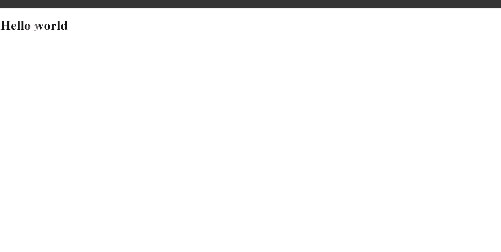
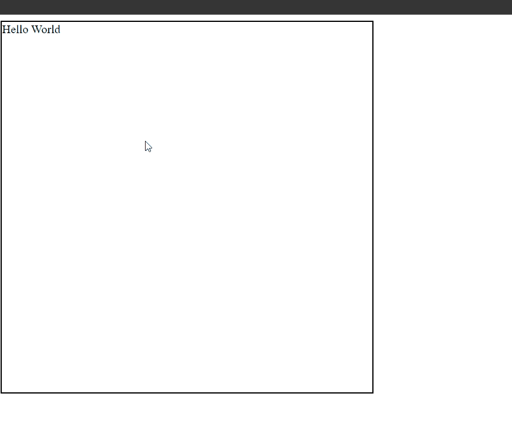
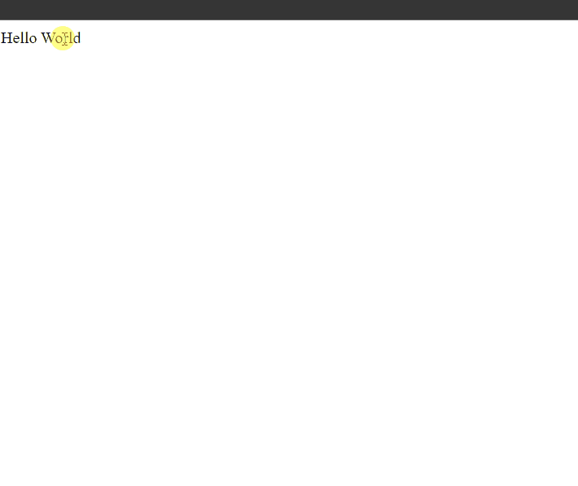
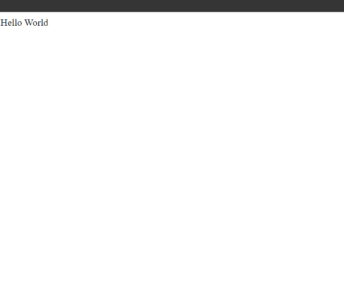
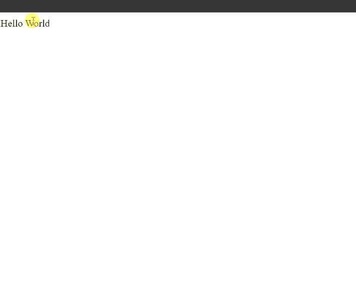
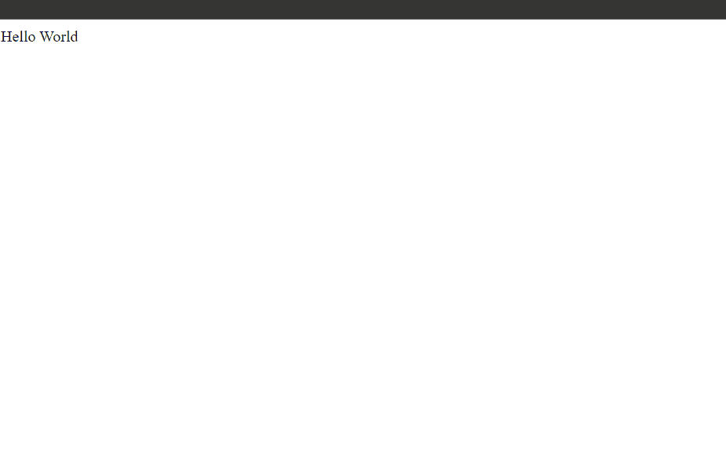
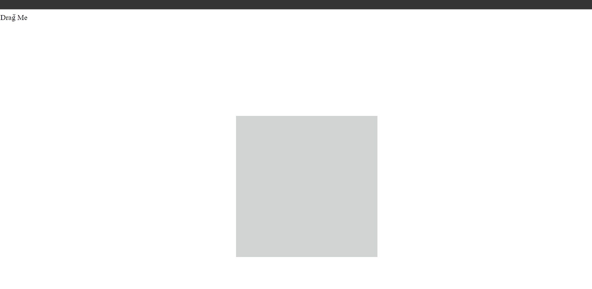
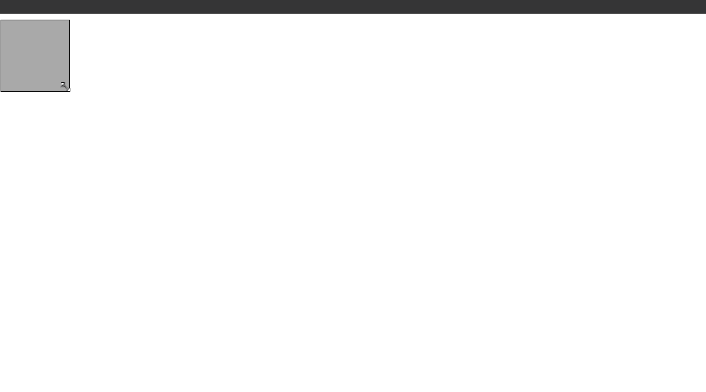
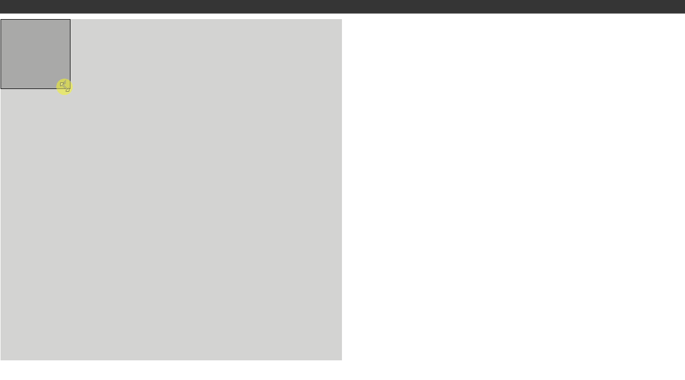
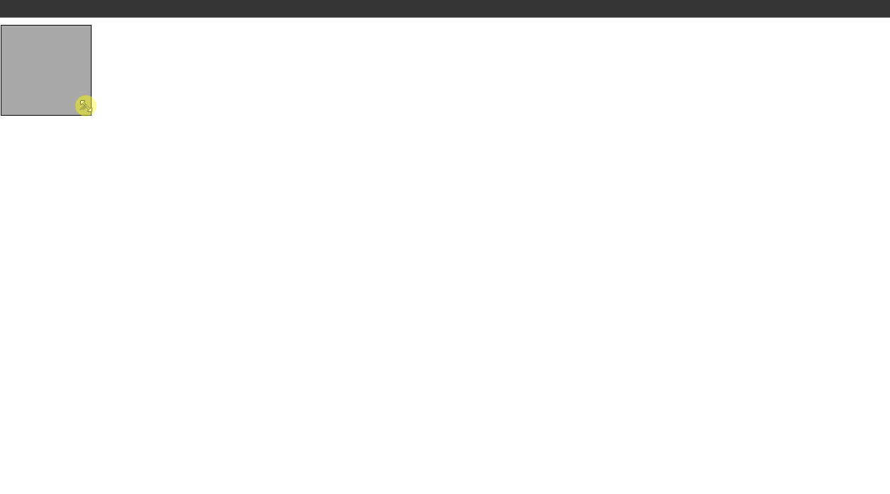

# The New Bonston Snippets

## 1. Draggable () snippets


### Example 1

```HTML
<!DOCTYPE html>

<html>

	<head>

		<title>This is the title</title>

        <link href="jquery-ui.min.css" rel="stylesheet" type="text/css" />
        <link href="style.css" rel="stylesheet" type="text/css" />

	</head>

<body>

    <h1 id="d" >Hello world</h1>

    <script src="jquery-3.2.1.min.js" type="text/javascript"></script>
    <script src="jquery-ui.min.js" type="text/javascript"></script>
    <script src="js.js" type="text/javascript"></script>

</body>

</html>
```

```JavaScript
$(document).ready(function () {

    $("#d").draggable();//This single line of code make that element draggable.

});

//jQuery UI used to make user interface applications.
//jQuery UI is written in jQuery.
//It hsa many functions.
//We can make any application easily.
```
### Output


### Example 1

#### HTML

```HTML
<!DOCTYPE html>

<html>

	<head>

		<title>This is the title</title>

        <link href="jquery-ui.min.css" rel="stylesheet" type="text/css" />
        <link href="style.css" rel="stylesheet" type="text/css" />

	</head>

<body>

    <h1 id="d" >Hello world</h1>

    <script src="jquery-3.2.1.min.js" type="text/javascript"></script>
    <script src="jquery-ui.min.js" type="text/javascript"></script>
    <script src="js.js" type="text/javascript"></script>

</body>

</html>
```

#### JavaScript

```JavaScript
$(document).ready(function () {

    $("#d").draggable({ axis: "x" });//This only allows to move Horizontally.

});

//jQuery UI used to make user interface applications.
//jQuery UI is written in jQuery.
//It hsa many functions.
//We can make any application easily.
```

### Output


### Example 2

#### HTML

```HTML
<!DOCTYPE html>

<html>

	<head>

		<title>This is the title</title>

        <link href="jquery-ui.min.css" rel="stylesheet" type="text/css" />
        <link href="style.css" rel="stylesheet" type="text/css" />

	</head>

<body>

    <h1 id="d" >Hello world</h1>

    <script src="jquery-3.2.1.min.js" type="text/javascript"></script>
    <script src="jquery-ui.min.js" type="text/javascript"></script>
    <script src="js.js" type="text/javascript"></script>

</body>

</html>
```

#### JavaScript

```JavaScript
$(document).ready(function () {

    $("#d").draggable({ axis: "y" });//This only allows to move vertically.

});

//jQuery UI used to make user interface applications.
//jQuery UI is written in jQuery.
//It hsa many functions.
//We can make any application easily.
```

### Output



### Example 3

#### HTML

```HTML
<!DOCTYPE html>

<html>

	<head>

		<title>This is the title</title>

        <link href="style.css" rel="stylesheet" type="text/css" />

	</head>

<body>

    <span id="d" >Hello World</span>

    <script src="jquery-3.2.1.min.js" type="text/javascript"></script>
    <script src="jquery-ui.min.js" type="text/javascript"></script>
    <script src="js.js" type="text/javascript"></script>

</body>

</html>
```

#### JavaScript

```JavaScript
$(document).ready(function () {

    $("#d").draggable({ containment: 'document' });//This only allows to move within the document.

});

//jQuery UI used to make user interface applications.
//jQuery UI is written in jQuery.
//It hsa many functions.
//We can make any application easily.
```

### Output


### Example 4

#### HTML

```HTML
<!DOCTYPE html>

<html>

	<head>

		<title>This is the title</title>

        <link href="style.css" rel="stylesheet" type="text/css" />

	</head>

<body>

    <span id="d" >Hello World</span>

    <script src="jquery-3.2.1.min.js" type="text/javascript"></script>
    <script src="jquery-ui.min.js" type="text/javascript"></script>
    <script src="js.js" type="text/javascript"></script>

</body>

</html>
```

#### JavaScript

```JavaScript
$(document).ready(function () {

    $("#d").draggable({ containment: 'window' });//This only allows to move within the window.

});

//jQuery UI used to make user interface applications.
//jQuery UI is written in jQuery.
//It hsa many functions.
//We can make any application easily.
```

### Output


### Example 5

#### HTML

```HTML
<!DOCTYPE html>

<html>

	<head>

		<title>This is the title</title>

        <link href="style.css" rel="stylesheet" type="text/css" />

	</head>

<body>

    <div id="box">

        <span id="d">Hello World</span>

    </div>

    <script src="jquery-3.2.1.min.js" type="text/javascript"></script>
    <script src="jquery-ui.min.js" type="text/javascript"></script>
    <script src="js.js" type="text/javascript"></script>

</body>

</html>
```

#### CSS

```CSS
#box {

    width:500px;
    height:500px;
    border:2px solid black;

}
```

#### JavaScript

```JavaScript
$(document).ready(function () {

    $("#d").draggable({ containment: 'parent' });//This only allows to move within the parent element.

});

//jQuery UI used to make user interface applications.
//jQuery UI is written in jQuery.
//It hsa many functions.
//We can make any application easily.

```

### Output



### Example 6

#### HTML

```HTML
<!DOCTYPE html>

<html>

	<head>

		<title>This is the title</title>

        <link href="style.css" rel="stylesheet" type="text/css" />

	</head>

<body>

    <div id="box">

        <span id="d">Hello World</span>

    </div>

    <script src="jquery-3.2.1.min.js" type="text/javascript"></script>
    <script src="jquery-ui.min.js" type="text/javascript"></script>
    <script src="js.js" type="text/javascript"></script>

</body>

</html>
```

#### CSS

```CSS
#box {

    width:500px;
    height:500px;
    border:2px solid black;

}
```

#### JavaScript

```JavaScript
$(document).ready(function () {

    $("#d").draggable({ axis:"x",containment: 'parent' });//This only allows to move within the parent element horzontally.

});

//jQuery UI used to make user interface applications.
//jQuery UI is written in jQuery.
//It hsa many functions.
//We can make any application easily.

$(document).ready(function () {

    $("#d").draggable({ axis:"x",containment: 'parent' });//This only allows to move within the parent element horzontally.

});

//jQuery UI used to make user interface applications.
//jQuery UI is written in jQuery.
//It hsa many functions.
//We can make any application easily.
```

### Output


### Example 7

#### HTML

```HTML
<!DOCTYPE html>

<html>

	<head>

		<title>This is the title</title>

        <link href="style.css" rel="stylesheet" type="text/css" />

	</head>

<body>

        <span id="d">Hello World</span>

    <script src="jquery-3.2.1.min.js" type="text/javascript"></script>
    <script src="jquery-ui.min.js" type="text/javascript"></script>
    <script src="js.js" type="text/javascript"></script>

</body>

</html>
```

#### JavaScript

```JavaScript
$(document).ready(function () {

    $("#d").draggable({containment:[0,0,200,200]}); //{containment: [x1,y1 x2, y2] } x1 and y1 are the starting area. x2 and y2 are the end area.
                                                    //This only allows to move within this coordinans area.This will take an array format.
});

//jQuery UI used to make user interface applications.
//jQuery UI is written in jQuery.
//It hsa many functions.
//We can make any application easily.
```

### Output


### Example 8

#### HTML

```HTML
<!DOCTYPE html>

<html>

	<head>

		<title>This is the title</title>

        <link href="style.css" rel="stylesheet" type="text/css" />

	</head>

<body>

        <span id="d">Hello World</span>

    <script src="jquery-3.2.1.min.js" type="text/javascript"></script>
    <script src="jquery-ui.min.js" type="text/javascript"></script>
    <script src="js.js" type="text/javascript"></script>

</body>

</html>
```

#### JavaScript

```JavaScript
$(document).ready(function () {

    $("#d").draggable({ containment: [0, 0, 500, 500], cursor: "pointer", opacity: 0.5 });//The cursor is used to give cursors.
                                                                                         //opacity will change while we are dragging
});

//jQuery UI used to make user interface applications.
//jQuery UI is written in jQuery.
//It hsa many functions.
//We can make any application easily.
```

### Output


### Example 9

#### HTML

```HTML
<!DOCTYPE html>

<html>

	<head>

		<title>This is the title</title>

        <link href="style.css" rel="stylesheet" type="text/css" />

	</head>

<body>

        <span id="d">Hello World</span>

    <script src="jquery-3.2.1.min.js" type="text/javascript"></script>
    <script src="jquery-ui.min.js" type="text/javascript"></script>
    <script src="js.js" type="text/javascript"></script>

</body>

</html>
```

#### JavaScript

```JavaScript
$(document).ready(function () {

    $("#d").draggable({ containment: "doument",grid:[20,20]});//The grid is for giving some grid options for moving.

});

//jQuery UI used to make user interface applications.
//jQuery UI is written in jQuery.
//It hsa many functions.
//We can make any application easily.
```

### Output



### Example 10

#### HTML

```HTML
<!DOCTYPE html>

<html>

	<head>

		<title>This is the title</title>

        <link href="style.css" rel="stylesheet" type="text/css" />

	</head>

<body>

        <span id="d">Hello World</span>

    <script src="jquery-3.2.1.min.js" type="text/javascript"></script>
    <script src="jquery-ui.min.js" type="text/javascript"></script>
    <script src="js.js" type="text/javascript"></script>

</body>

</html>
```

#### JavaScript

```JavaScript
$(document).ready(function () {

    $("#d").draggable({ containment: "doument", revert: true});//The revert will move the element back to the original position while the dragging finished.

});

//jQuery UI used to make user interface applications.
//jQuery UI is written in jQuery.
//It hsa many functions.
//We can make any application easily.
```

### Output



### Example 11

#### HTML

```HTML
<!DOCTYPE html>

<html>

	<head>

		<title>This is the title</title>

        <link href="style.css" rel="stylesheet" type="text/css" />

	</head>

<body>

        <span id="d">Hello World</span>

    <script src="jquery-3.2.1.min.js" type="text/javascript"></script>
    <script src="jquery-ui.min.js" type="text/javascript"></script>
    <script src="js.js" type="text/javascript"></script>

</body>

</html>
```

#### JavaScript

```JavaScript
$(document).ready(function () {

    $("#d").draggable({ containment: "doument", revert: true, revertDuration: 5000 });//The revert will move the element back to the original position while the dragging finished.                                                                                      //The revertDuration is the duration

});

//jQuery UI used to make user interface applications.
//jQuery UI is written in jQuery.
//It hsa many functions.
//We can make any application easily.
```

### Output



### Example 12

#### HTML

```HTML
<!DOCTYPE html>

<html>

	<head>

		<title>This is the title</title>

        <link href="style.css" rel="stylesheet" type="text/css" />

	</head>

<body>
        <span id="d">Hello World</span>

    <div id="event"></div>

    <script src="jquery-3.2.1.min.js" type="text/javascript"></script>
    <script src="jquery-ui.min.js" type="text/javascript"></script>
    <script src="js.js" type="text/javascript"></script>

</body>

</html>
```

#### JavaScript

```JavaScript
$(document).ready(function () {

    $("#d").draggable({
        containment: "doument",
        revert: true,

        start: function () {//start is an event.

            $("#event").text("The dragging is started");

            //This will run when the dragging started.

        },

    });

});

//jQuery UI used to make user interface applications.
//jQuery UI is written in jQuery.
//It hsa many functions.
//We can make any application easily.
```

### Output


### Example 13

#### HTML

```HTML
<!DOCTYPE html>

<html>

	<head>

		<title>This is the title</title>

        <link href="style.css" rel="stylesheet" type="text/css" />

	</head>

<body>

        <span id="d">Hello World</span>

    <div id="event"></div>

    <script src="jquery-3.2.1.min.js" type="text/javascript"></script>
    <script src="jquery-ui.min.js" type="text/javascript"></script>
    <script src="js.js" type="text/javascript"></script>

</body>

</html>
```

#### JavaScript

```JavaScript
$(document).ready(function () {

    $("#d").draggable({
        containment: "doument",
        revert: true,

        drag: function () {//start is an event.

            $("#event").text("The element is dragging ");

            //This will run while the element is dragging.
            //start event and the drag event are slightly same but they are not.
        },

    });

});

//jQuery UI used to make user interface applications.
//jQuery UI is written in jQuery.
//It hsa many functions.
//We can make any application easily.
```

### Output



### Example 14

#### HTML

```HTML
<!DOCTYPE html>

<html>

	<head>

		<title>This is the title</title>

        <link href="style.css" rel="stylesheet" type="text/css" />

	</head>

<body>

        <span id="d">Hello World</span>

    <div id="event"></div>

    <script src="jquery-3.2.1.min.js" type="text/javascript"></script>
    <script src="jquery-ui.min.js" type="text/javascript"></script>
    <script src="js.js" type="text/javascript"></script>

</body>

</html>
```

#### JavaScript

```JavaScript
$(document).ready(function () {

    $("#d").draggable({
        containment: "doument",
        revert: true,

        drag: function () {//start is an event.

            $("#event").text("The element is dragging ");

            //This will run while the element is dragging.
            //start event and the drag event are slightly same but they are not.
        },
        stop: function () {//This will run when the dragging is stoped.

            $("#event").text("The dragging stoped");
            $("#event").css("color", "red");
        }

    });

});

//There are many events and other effects in jqueryui website.
//We can easily learn them without studing too much.
```

### Output


## 2. Droppable () snippets

### Example 0

#### HTML

```HTML
<!DOCTYPE html>

<html>

	<head>

		<title>This is the title</title>

        <link href="style.css" rel="stylesheet" type="text/css" />

	</head>

<body>

    <span id="drag">Drag Me</span>

    <div id="drop">

    </div>

    <script src="jquery-3.2.1.min.js" type="text/javascript"></script>
    <script src="jquery-ui.min.js" type="text/javascript"></script>
    <script src="js.js" type="text/javascript"></script>

</body>

</html>
```

#### CSS

```CSS
#drop {

    width:300px;
    height:300px;
    border:2px solid red;
    position:relative;
    left:500px;
    top:200px;
}
```

#### JavaScript

```JavaScript
$(document).ready(function () {

    $("#drag").draggable({

        containment: 'document',
        revert:true

    });

    $("#drop").droppable({//The droppable is the place that we want to drop.

        drop: function () {//The drop is a function it works when we drop an element into it.

            alert("dropped");
        }
    });

});
```

### Output


### Example 1

#### HTML

```HTML
<!DOCTYPE html>

<html>

	<head>

		<title>This is the title</title>

        <link href="style.css" rel="stylesheet" type="text/css" />

	</head>

<body>

    <span id="drag" style="z-index:10;">Drag Me</span>

    <div id="drop">

    </div>

    <script src="jquery-3.2.1.min.js" type="text/javascript"></script>
    <script src="jquery-ui.min.js" type="text/javascript"></script>
    <script src="js.js" type="text/javascript"></script>

</body>

</html>
```

#### CSS

```CSS
#drop {

    width:300px;
    height:300px;
    background-color:lightgray;
    position:relative;
    left:500px;
    top:200px;
    z-index:0;
}

.border {

    border:2px solid red;

}
```

#### JavaScript

```JavaScript
$(document).ready(function () {

    $("#drag").draggable({

        containment: 'document',
        revert:true

    });

    $("#drop").droppable({//The droppable is the place that we want to drop.

        hoverClass: "border"//The hoverClass is used to give a class when we are hovering over it.

    });

});
```

### Output


### Example 2

#### HTML

```HTML
<!DOCTYPE html>

<html>

	<head>

		<title>This is the title</title>

        <link href="style.css" rel="stylesheet" type="text/css" />

	</head>

<body>

    <span id="drag" style="z-index:10;">Drag Me</span>

    <div id="drop">

    </div>

    <script src="jquery-3.2.1.min.js" type="text/javascript"></script>
    <script src="jquery-ui.min.js" type="text/javascript"></script>
    <script src="js.js" type="text/javascript"></script>

</body>

</html>
```

#### CSS

```CSS
#drop {

    width:300px;
    height:300px;
    background-color:lightgray;
    position:relative;
    left:500px;
    top:200px;
    z-index:0;
}

.border {

    border:2px solid red;

}
```

#### JavaScript

```JavaScript
$(document).ready(function () {

    $("#drag").draggable({

        containment: 'document',
        revert:true

    });

    $("#drop").droppable({//The droppable is the place that we want to drop.

        hoverClass: "border",
        tolerance:"fit"//The tolerance fit means you have to put the element fully in the drop box.

    });

});
```

### Output



### Example 3

#### HTML

```HTML
<!DOCTYPE html>

<html>

	<head>

		<title>This is the title</title>

        <link href="style.css" rel="stylesheet" type="text/css" />

	</head>

<body>

    <span id="drag" style="z-index:10;">Drag Me</span>

    <div id="drop">

    </div>

    <script src="jquery-3.2.1.min.js" type="text/javascript"></script>
    <script src="jquery-ui.min.js" type="text/javascript"></script>
    <script src="js.js" type="text/javascript"></script>

</body>

</html>
```

#### CSS

```CSS
#drop {

    width:300px;
    height:300px;
    background-color:lightgray;
    position:relative;
    left:500px;
    top:200px;
    z-index:0;
}

.border {

    border:2px solid red;

}
```

#### JavaScript

```JavaScript
$(document).ready(function () {

    $("#drag").draggable({

        containment: 'document',
        revert:true

    });

    $("#drop").droppable({//The droppable is the place that we want to drop.

        hoverClass: "border",
        tolerance: "intersect"//The tolerance intersect is the default.You don't have to put the element fully 50%.

    });

});
```

### Output


### Example 4

#### HTML

```HTML
<!DOCTYPE html>

<html>

	<head>

		<title>This is the title</title>

        <link href="style.css" rel="stylesheet" type="text/css" />

	</head>

<body>

    <span id="drag" style="z-index:10;">Drag Me</span>

    <div id="drop">

    </div>

    <script src="jquery-3.2.1.min.js" type="text/javascript"></script>
    <script src="jquery-ui.min.js" type="text/javascript"></script>
    <script src="js.js" type="text/javascript"></script>

</body>

</html>
```

#### CSS

```CSS
#drop {

    width:300px;
    height:300px;
    background-color:lightgray;
    position:relative;
    left:500px;
    top:200px;
    z-index:0;
}

.border {

    border:2px solid red;

}
```

#### JavaScript

```JavaScript
$(document).ready(function () {

    $("#drag").draggable({

        containment: 'document',
        revert:true

    });

    $("#drop").droppable({//The droppable is the place that we want to drop.

        hoverClass: "border",
        tolerance: "pointer"//The tolerance pointer works when the mouse pointer is touch the drop box.

    });

});
```

### Output


### Example 5

#### HTML

```HTML
<!DOCTYPE html>

<html>

	<head>

		<title>This is the title</title>

        <link href="style.css" rel="stylesheet" type="text/css" />

	</head>

<body>

    <span id="drag" style="z-index:10;">Drag Me</span>

    <div id="drop">

    </div>

    <script src="jquery-3.2.1.min.js" type="text/javascript"></script>
    <script src="jquery-ui.min.js" type="text/javascript"></script>
    <script src="js.js" type="text/javascript"></script>

</body>

</html>
```

#### CSS

```CSS
#drop {

    width:300px;
    height:300px;
    background-color:lightgray;
    position:relative;
    left:500px;
    top:200px;
    z-index:0;
}

.border {

    border:2px solid red;

}
```

#### JavaScript

```JavaScript
$(document).ready(function () {

    $("#drag").draggable({

        containment: 'document',
        revert:true

    });

    $("#drop").droppable({//The droppable is the place that we want to drop.

        hoverClass: "border",
        tolerance: "touch"//The tolerance touch works when it is touched the box.

    });

});
```

### Output


### Example 6

#### HTML

```HTML
<!DOCTYPE html>

<html>

	<head>

		<title>This is the title</title>

        <link href="style.css" rel="stylesheet" type="text/css" />

	</head>

<body>

    <span class="names">Joker</span><br />
    <span class="names">Hacker</span><br />

    <span class="place">US</span><br />
    <span class="place">UK</span><br />

    <div id="drop">

    </div>

    <script src="jquery-3.2.1.min.js" type="text/javascript"></script>
    <script src="jquery-ui.min.js" type="text/javascript"></script>
    <script src="js.js" type="text/javascript"></script>

</body>

</html>
```

#### CSS

```CSS
#drop {

    width:300px;
    height:300px;
    background-color:lightgray;
    position:relative;
    left:500px;
    top:200px;
    z-index:0;
    padding:20px;
}

.border {

    border:2px solid red;

}

.names, .place {

z-index:10;
}
```

#### JavaScript

```JavaScript
$(document).ready(function () {

    $(".names,.place").draggable({

        containment: "document",
        cursor: "pointer",
        revert:true

    });

    $("#drop").droppable({
        hoverClass: "border",
        tolerance: "pointer",//we can drop when mouse pointer hits the drop box.
        accept:".names",//This will only allow .name classes but place classes does not allow.

        over: function () {//This will works if something overs the drop box.

            $("#drop").text("Someting has over the drop box");
        },

        out: function () {//This will work something is got away form the drop box.

            $("#drop").text("Something has left form the drop box ");

        },

        drop: function () {//This will work if anyting drops in the box.

            alert("Dropped finished");

        }

    });

});
```

### Output


## 3. Sortable () Snippets

### Example 0

#### HTML

```HTML
<!DOCTYPE html>

<html>

	<head>

		<title>This is the title</title>

        <link href="style.css" rel="stylesheet" type="text/css" />

	</head>

<body>

    <ul id="names">

        <li>Kuna</li>
        <li>Rakulan</li>
        <li>Joker</li>
        <li>Hacker</li>
        <li>GTA</li>

    </ul>

    <script src="jquery-3.2.1.min.js" type="text/javascript"></script>
    <script src="jquery-ui.min.js" type="text/javascript"></script>
    <script src="js.js" type="text/javascript"></script>

</body>

</html>
```

#### CSS

```CSS
#names {

    padding:10px;
    list-style-type:none;
    width:200px;
    height:200px;
}
```

#### JavaScript

```JavaScript
$(document).ready(function () {

    $("#names").sortable({

        containment: "document",//I can move the elements within the document.
        cursor: "pointer",//It has pointer cursor.
        tolerance: "pointer",//when the pointer of the mouse hit the next element this will change.
        revert: true,//This will send the element to the normal position.
        opacity:0.5//This is opcity value.

    });

});

//The sortable() function is used for changing the potion of the elements.It is used for alinetmenting purpose.
```

### Output


### Example 1

#### HTML

```HTML
<!DOCTYPE html>

<html>

	<head>

		<title>This is the title</title>

        <link href="style.css" rel="stylesheet" type="text/css" />

	</head>

<body>

    <ul id="names">

        <li>Kuna</li>
        <li>Rakulan</li>
        <li>Joker</li>
        <li>Hacker</li>
        <li>GTA</li>

    </ul>

    <ul id="places">

        <li>United Kindom</li>
        <li>United State</li>
        <li>New York City</li>
        <li>India</li>
        <li>Sri Lanka</li>
    </ul>

    <div id="sort">

    </div>

    <script src="jquery-3.2.1.min.js" type="text/javascript"></script>
    <script src="jquery-ui.min.js" type="text/javascript"></script>
    <script src="js.js" type="text/javascript"></script>

</body>

</html>
```

#### CSS

```CSS
#names {

    padding:10px;
    list-style-type:none;

}

#places {

    padding:10px;
    list-style-type:none;

}

#sort {

    color:red;

}
```

#### JavaScript

```JavaScript
$(document).ready(function () {

    $("#names,#places").sortable({

        containment: "document",//I can move the elements within the document.
        cursor: "pointer",//It has pointer cursor.
        tolerance: "pointer",//when the pointer of the mouse hit the next element this will change.
        revert: true,//This will send the element to the normal position.
        opacity:0.5,//This is opcity value.
        connectWith: "#names,#places",//Now #names and #places has been connected together.We can move from #names to #places.
        update: function () {//This works when an element updates.

            var con=$(this).text()//This variable got the all texts.

            $("#sort").text(con);
        },

    });

});

//The sortable() function is used for changing the potion of the elements.It is used for alinetmenting purpose.
```

### Output


## 4. Resizable () Snippets

### Example 0

#### HTML

```HTML
<!DOCTYPE html>

<html>

	<head>

		<title>This is the title</title>

        <link href="style.css" rel="stylesheet" type="text/css" />
        <link href="jquery-ui.min.css" rel="stylesheet" type="text/css" />

	</head>

<body>

        <div id="box"></div>

    <script src="jquery-3.2.1.min.js" type="text/javascript"></script>
    <script src="jquery-ui.min.js" type="text/javascript"></script>
    <script src="js.js" type="text/javascript"></script>

</body>

</html>
```

#### CSS

```CSS
#box {

    width:100px;
    height:100px;
    background-color:darkgray;
    border:1px solid black;

}
```

#### JavaScript

```JavaScript
$(document).ready(function () {

    $("#box").resizable();

});

//The resizable() function is used to make resizable boxes and elements.
```

### Output



### Example 1

#### HTML

```HTML
<!DOCTYPE html>

<html>

	<head>

		<title>This is the title</title>

        <link href="style.css" rel="stylesheet" type="text/css" />
        <link href="jquery-ui.min.css" rel="stylesheet" type="text/css" />

	</head>

<body>

    <div id="big_box">

        <div id="box"></div>

    </div>

    <script src="jquery-3.2.1.min.js" type="text/javascript"></script>
    <script src="jquery-ui.min.js" type="text/javascript"></script>
    <script src="js.js" type="text/javascript"></script>

</body>

</html>
```

#### CSS

```CSS
#box {

    width:100px;
    height:100px;
    background-color:darkgray;
    border:1px solid black;

}

#big_box {

    width:500px;
    height:500px;
    background-color:lightgray;

}
```

#### JavaScript

```JavaScript
$(document).ready(function () {

    $("#box").resizable({

        containment:"parent"

    });

});

//The resizable() function is used to make resizable boxes and elements.
```

### Output



### Example 2

#### HTML

```HTML
<!DOCTYPE html>

<html>

	<head>

		<title>This is the title</title>

        <link href="style.css" rel="stylesheet" type="text/css" />
        <link href="jquery-ui.min.css" rel="stylesheet" type="text/css" />

	</head>

<body>

        <div id="box"></div>

    <script src="jquery-3.2.1.min.js" type="text/javascript"></script>
    <script src="jquery-ui.min.js" type="text/javascript"></script>
    <script src="js.js" type="text/javascript"></script>

</body>

</html>
```

#### CSS

```CSS
#box {

    width:100px;
    height:100px;
    background-color:darkgray;
    border:1px solid black;

}
```

#### JavaScript

```JavaScript
$(document).ready(function () {

    $("#box").resizable({

        animate:true//This will give an animation resize

    });

});

//The resizable() function is used to make resizable boxes and elements.
```

### Output


### Example 3

#### HTML

```HTML
<!DOCTYPE html>

<html>

	<head>

		<title>This is the title</title>

        <link href="style.css" rel="stylesheet" type="text/css" />
        <link href="jquery-ui.min.css" rel="stylesheet" type="text/css" />

	</head>

<body>

        <div id="box"></div>

    <script src="jquery-3.2.1.min.js" type="text/javascript"></script>
    <script src="jquery-ui.min.js" type="text/javascript"></script>
    <script src="js.js" type="text/javascript"></script>

</body>

</html>
```

#### CSS

```CSS
#box {

    width:100px;
    height:100px;
    background-color:darkgray;
    border:1px solid black;

}
```

#### JavaScript

```JavaScript
$(document).ready(function () {

    $("#box").resizable({

        ghost:true//This will show a shadow.

    });

});

//The resizable() function is used to make resizable boxes and elements.
```

### Output


### Example 4

#### HTML

```HTML
<!DOCTYPE html>

<html>

	<head>

		<title>This is the title</title>

        <link href="style.css" rel="stylesheet" type="text/css" />
        <link href="jquery-ui.min.css" rel="stylesheet" type="text/css" />

	</head>

<body>

        <div id="box"></div>

    <script src="jquery-3.2.1.min.js" type="text/javascript"></script>
    <script src="jquery-ui.min.js" type="text/javascript"></script>
    <script src="js.js" type="text/javascript"></script>

</body>

</html>
```

#### CSS

```CSS
#box {

    width:100px;
    height:100px;
    background-color:darkgray;
    border:1px solid black;

}
```

#### JavaScript

```JavaScript
$(document).ready(function () {

    $("#box").resizable({
        animate: true,//We have an animation
        animationDuration: "solw",//This is the duration of the animation.
        animateEasing: "linear",//This is type of the animation by default it is swing.
        autoHide: true,//autoHide hides the resize button when you over the element it will appear.
        grid:[20,20],//This is grid it will resize by 20 width and 20 height.
        ghost:true//This will show a shadow.

    });

});

//The resizable() function is used to make resizable boxes and elements.
```

### Output


### Example 0

#### HTML

```HTML
<!DOCTYPE html>

<html>

	<head>

		<title>This is the title</title>

        <link href="style.css" rel="stylesheet" type="text/css" />
        <link href="jquery-ui.min.css" rel="stylesheet" type="text/css" />

	</head>

<body>

        <div id="box"></div>

    <script src="jquery-3.2.1.min.js" type="text/javascript"></script>
    <script src="jquery-ui.min.js" type="text/javascript"></script>
    <script src="js.js" type="text/javascript"></script>

</body>

</html>
```

#### CSS

```CSS
#box {

    width:100px;
    height:100px;
    background-color:darkgray;
    border:1px solid black;

}
```

#### JavaScript

```JavaScript
$(document).ready(function () {

    $("#box").resizable({

        grid:[50,50]//This will increse the height and width by 50 50.
    });

});

//The resizable() function is used to make resizable boxes and elements.
```

### Output


### Example 6

#### HTML

```HTML
<!DOCTYPE html>

<html>

	<head>

		<title>This is the title</title>

        <link href="style.css" rel="stylesheet" type="text/css" />
        <link href="jquery-ui.min.css" rel="stylesheet" type="text/css" />

	</head>

<body>

        <div id="box"></div>

    <script src="jquery-3.2.1.min.js" type="text/javascript"></script>
    <script src="jquery-ui.min.js" type="text/javascript"></script>
    <script src="js.js" type="text/javascript"></script>

</body>

</html>
```

#### CSS

```CSS
#box {

    width:100px;
    height:100px;
    background-color:darkgray;
    border:1px solid black;

}
```

#### JavaScript

```JavaScript
$(document).ready(function () {

    $("#box").resizable({

        handles:"e"
    });

});

//e for east
//n for north
//s for south
//w for west
//ne for north east
//se for south east
//sw for south west
//and so on.

//The resizable() function is used to make resizable boxes and elements.
```

### Output


### Example 7

#### HTML

```HTML
<!DOCTYPE html>

<html>

	<head>

		<title>This is the title</title>

        <link href="style.css" rel="stylesheet" type="text/css" />
        <link href="jquery-ui.min.css" rel="stylesheet" type="text/css" />

	</head>

<body>

        <div id="box"></div>

    <script src="jquery-3.2.1.min.js" type="text/javascript"></script>
    <script src="jquery-ui.min.js" type="text/javascript"></script>
    <script src="js.js" type="text/javascript"></script>

</body>

</html>
```

#### CSS

```CSS
#box {

    width:100px;
    height:100px;
    background-color:darkgray;
    border:1px solid black;

}
```

#### JavaScript

```JavaScript
$(document).ready(function () {

    $("#box").resizable({

        handles:"all"//This will allow from all sides.we can resize from all sides.
    });

});

//The resizable() function is used to make resizable boxes and elements.
```

### Output


### Example 8

#### HTML

```HTML
<!DOCTYPE html>

<html>

	<head>

		<title>This is the title</title>

        <link href="style.css" rel="stylesheet" type="text/css" />
        <link href="jquery-ui.min.css" rel="stylesheet" type="text/css" />

	</head>

<body>

        <div id="box"></div>

    <script src="jquery-3.2.1.min.js" type="text/javascript"></script>
    <script src="jquery-ui.min.js" type="text/javascript"></script>
    <script src="js.js" type="text/javascript"></script>

</body>

</html>
```

#### CSS

```CSS
#box {

    width:100px;
    height:100px;
    background-color:darkgray;
    border:1px solid black;

}
```

#### JavaScript

```JavaScript
$(document).ready(function () {

    $("#box").resizable({

        maxWidth: 250,//Maximum Width resizable
        maxHeight: 250,//Maximum Height resizable
        minWidth: 100,//Minimum Width resizable
        minHeight: 100//Minimum Height resizable

    });

});

//The resizable() function is used to make resizable boxes and elements.
```

### Output


