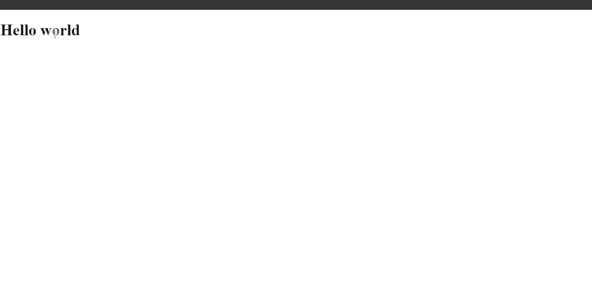

# The New Bonston Snippets

## 1. Draggable () snippets


### Example 1

```HTML
<!DOCTYPE html>

<html>

	<head>

		<title>This is the title</title>

        <link href="jquery-ui.min.css" rel="stylesheet" type="text/css" />
        <link href="style.css" rel="stylesheet" type="text/css" />

	</head>

<body>

    <h1 id="d" >Hello world</h1>

    <script src="jquery-3.2.1.min.js" type="text/javascript"></script>
    <script src="jquery-ui.min.js" type="text/javascript"></script>
    <script src="js.js" type="text/javascript"></script>

</body>

</html>
```

```JavaScript
$(document).ready(function () {

    $("#d").draggable();//This single line of code make that element draggable.

});

//jQuery UI used to make user interface applications.
//jQuery UI is written in jQuery.
//It hsa many functions.
//We can make any application easily.
```
### Output


