## 5. Accordion () Snippets

### Example 0

#### HTML

```HTML
<!DOCTYPE html>

<html>

	<head>

		<title>This is the title</title>

        <link href="style.css" rel="stylesheet" type="text/css" />

        <link href="jquery-ui.min.css" type="text/css" rel="stylesheet">

	</head>

<body>

<div id="a1">

    <h4><a href="#">Java</a></h4>

    <div>

        <h1>Java Programming</h1>
        <h4>Java is the best programming language It is vert easy to master</h4>
    </div>

    <h4><a href="#">C++</a></h4>

    <div>

        <h1>C++ Programming</h1>
        <h4>
            C++ is the traditional programming language.It is mainly used to develop not only website application even we can create opreating system in c++
        </h4>

    </div>

    <h4><a href="#">Python</a></h4>
    <div>

        <h1>Python is a simple programming language</h1>
        <h4>We can make many applications in python</h4>

    </div>
</div>

    <script src="jquery-3.2.1.min.js" type="text/javascript"></script>
    <script src="jquery-ui.min.js" type="text/javascript"></script>
    <script src="js.js" type="text/javascript"></script>

</body>

</html>
```

#### JavaScript

```JavaScript
$(document).ready(function () {

    $("#a1").accordion();

});

//The accordion() will pick up all elements form the html and make them as accordion.
//a1 is the id of a div element.
//in that div element i have some a tags and some other divs elements.
//jquery ui automatically make as an accordion if you applied the accordion() to the element.
```

### Output


### Example 1

#### HTML

```HTML
<!DOCTYPE html>

<html>

	<head>

		<title>This is the title</title>

        <link href="style.css" rel="stylesheet" type="text/css" />

        <link href="jquery-ui.min.css" type="text/css" rel="stylesheet">

	</head>

<body>

<div id="a1">

    <h4 id="j"><a href="#">Java</a></h4>

    <div>

        <h1>Java Programming</h1>
        <h4>Java is the best programming language It is vert easy to master</h4>
    </div>

    <h4><a href="#">C++</a></h4>

    <div>

        <h1>C++ Programming</h1>
        <h4>
            C++ is the traditional programming language.It is mainly used to develop not only website application even we can create opreating system in c++
        </h4>

    </div>

    <h4><a href="#">Python</a></h4>
    <div>

        <h1>Python is a simple programming language</h1>
        <h4>We can make many applications in python</h4>

    </div>
</div>

    <script src="jquery-3.2.1.min.js" type="text/javascript"></script>
    <script src="jquery-ui.min.js" type="text/javascript"></script>
    <script src="js.js" type="text/javascript"></script>

</body>

</html>
```

#### CSS

```CSS
#j {

    background-color:red;

}
    #j:active {

        background-color:palegreen;
    }
```

#### JavaScript

```JavaScript
$(document).ready(function () {

    $("#a1").accordion({

        icons: { "header": 'ui-icon-plus' }//This the way to add icons.

    });

});

//The accordion() will pick up all elements form the html and make them as accordion.

//We change or modify the default styles in css.
//I have changed the color of the the java heading in the css to red.
//I've added some css styles in the css go hat and see that.
```

### Output

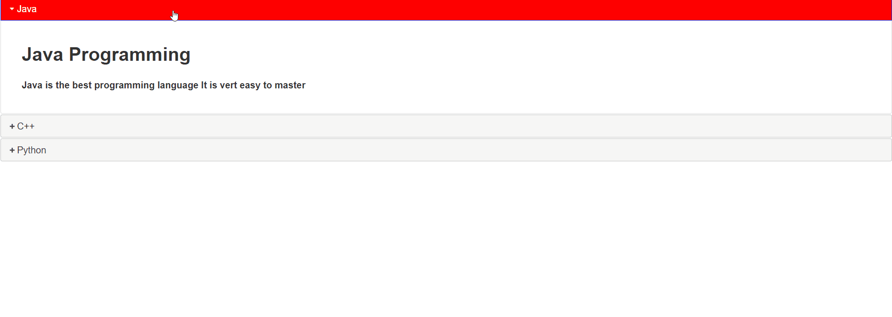

### Example 2

#### HTML

```HTML
<!DOCTYPE html>

<html>

	<head>

		<title>This is the title</title>

        <link href="style.css" rel="stylesheet" type="text/css" />

        <link href="jquery-ui.min.css" type="text/css" rel="stylesheet">

	</head>

<body>

<div id="a1">

    <h4 id="j"><a href="#">Java</a></h4>

    <div>

        <h1>Java Programming</h1>
        <h4>Java is the best programming language It is vert easy to master</h4>
    </div>

    <h4><a href="#">C++</a></h4>

    <div>

        <h1>C++ Programming</h1>
        <h4>
            C++ is the traditional programming language.It is mainly used to develop not only website application even we can create opreating system in c++
        </h4>

    </div>

    <h4><a href="#">Python</a></h4>
    <div>

        <h1>Python is a simple programming language</h1>
        <h4>We can make many applications in python</h4>

    </div>
</div>

    <script src="jquery-3.2.1.min.js" type="text/javascript"></script>
    <script src="jquery-ui.min.js" type="text/javascript"></script>
    <script src="js.js" type="text/javascript"></script>

</body>

</html>
```

#### JavaScript

```JavaScript
$(document).ready(function () {

    $("#a1").accordion({

      event:"mouseover"//By using event we can change the user events.We can assign any events that we want.

    });

});

//The accordion() will pick up all elements form the html and make them as accordion.
```

### Output

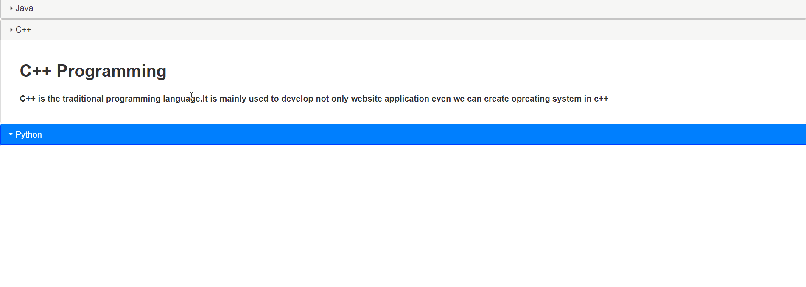

### Example 3

#### HTML

```HTML
<!DOCTYPE html>

<html>

	<head>

		<title>This is the title</title>

        <link href="style.css" rel="stylesheet" type="text/css" />

        <link href="jquery-ui.min.css" type="text/css" rel="stylesheet">

	</head>

<body>

<div id="a1">

    <h4 id="j"><a href="#">Java</a></h4>

    <div>

        <h1>Java Programming</h1>
        <h4>Java is the best programming language It is vert easy to master</h4>
    </div>

    <h4><a href="#">C++</a></h4>

    <div>

        <h1>C++ Programming</h1>
        <h4>
            C++ is the traditional programming language.It is mainly used to develop not only website application even we can create opreating system in c++
        </h4>

    </div>

    <h4><a href="#">Python</a></h4>
    <div>

        <h1>Python is a simple programming language</h1>
        <h4>We can make many applications in python</h4>

    </div>
</div>

    <script src="jquery-3.2.1.min.js" type="text/javascript"></script>
    <script src="jquery-ui.min.js" type="text/javascript"></script>
    <script src="js.js" type="text/javascript"></script>

</body>

</html>
```

#### JavaScript

```JavaScript
$(document).ready(function () {

    $("#a1").accordion({

        collapsible: true,//by default one pane will be open to prevent that you can this collapsible:true So now you can close all panes.even one pane will be open it can be closed

    });

});

//The accordion() will pick up all elements form the html and make them as accordion.
```

### Output


### Example 4

#### HTML

```HTML
<!DOCTYPE html>

<html>

	<head>

		<title>This is the title</title>

        <link href="style.css" rel="stylesheet" type="text/css" />

        <link href="jquery-ui.min.css" type="text/css" rel="stylesheet">

	</head>

<body>

<div id="a1">

    <h4 id="j"><a href="#">Java</a></h4>

    <div>

        <h1>Java Programming</h1>
        <h4>Java is the best programming language It is vert easy to master</h4>
    </div>

    <h4><a href="#">C++</a></h4>

    <div>

        <h1>C++ Programming</h1>
        <h4>
            C++ is the traditional programming language.It is mainly used to develop not only website application even we can create opreating system in c++
        </h4>

    </div>

    <h4><a href="#">Python</a></h4>
    <div>

        <h1>Python is a simple programming language</h1>
        <h4>We can make many applications in python</h4>

    </div>
</div>

    <script src="jquery-3.2.1.min.js" type="text/javascript"></script>
    <script src="jquery-ui.min.js" type="text/javascript"></script>
    <script src="js.js" type="text/javascript"></script>

</body>

</html>
```

#### JavaScript

```JavaScript
$(document).ready(function () {

    $("#a1").accordion({

        collapsible:true,
        active:2//This will open the third pane. 0 is first.

    });

});

//The accordion() will pick up all elements form the html and make them as accordion.
```

### Output

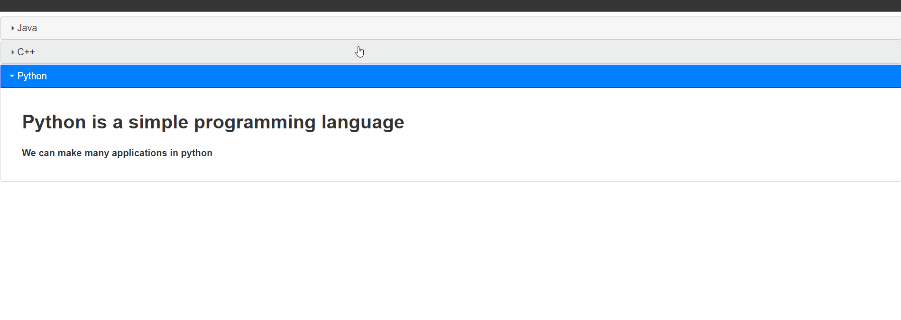

### Example 5

#### HTML

```HTML
<!DOCTYPE html>

<html>

	<head>

		<title>This is the title</title>

        <link href="style.css" rel="stylesheet" type="text/css" />

        <link href="jquery-ui.min.css" type="text/css" rel="stylesheet">

	</head>

<body>

<div id="a1">

    <h4 id="j"><a href="#">Java</a></h4>

    <div>

        <h1>Java Programming</h1>
        <h4>Java is the best programming language It is vert easy to master</h4>
    </div>

    <h4><a href="#">C++</a></h4>

    <div>

        <h1>C++ Programming</h1>
        <h4>
            C++ is the traditional programming language.It is mainly used to develop not only website application even we can create opreating system in c++
        </h4>

    </div>

    <h4><a href="#">Python</a></h4>
    <div>

        <h1>Python is a simple programming language</h1>
        <h4>We can make many applications in python</h4>

    </div>
</div>

    <script src="jquery-3.2.1.min.js" type="text/javascript"></script>
    <script src="jquery-ui.min.js" type="text/javascript"></script>
    <script src="js.js" type="text/javascript"></script>

</body>

</html>
```

#### JavaScript

```JavaScript
$(document).ready(function () {

    $("#a1").accordion({

        collapsible:true,
        active:false//This will closed all of them.

    });

});

//The accordion() will pick up all elements form the html and make them as accordion.
```

### Output

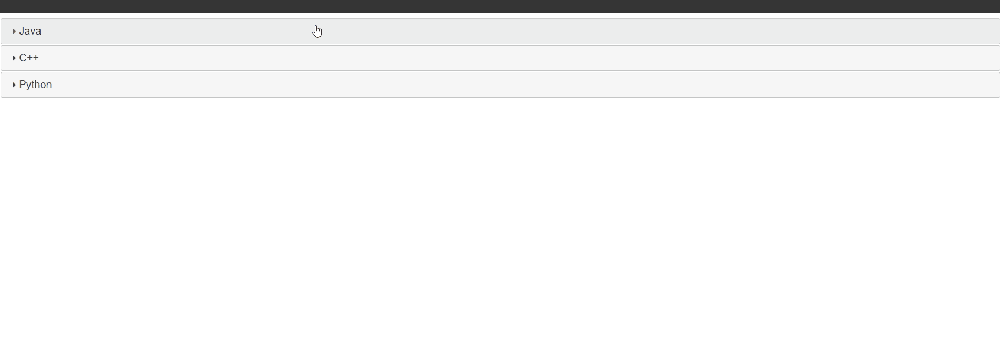

## 6. Date Picker () Snippets

### Example 0

#### HTML

```HTML
<!DOCTYPE html>

<html>

	<head>

		<title>This is the title</title>

        <link href="style.css" rel="stylesheet" type="text/css" />

        <link href="jquery-ui.min.css" type="text/css" rel="stylesheet">

	</head>

<body>

    <input type="text" size="8" id="date" />

    <script src="jquery-3.2.1.min.js" type="text/javascript"></script>
    <script src="jquery-ui.min.js" type="text/javascript"></script>
    <script src="js.js" type="text/javascript"></script>

</body>

</html>
```

#### JavaScript

```JavaScript
$(document).ready(function () {

    $("#date").datepicker();

});

//The datepicker() automatically makes an datepicker for us easily.
```

### Output

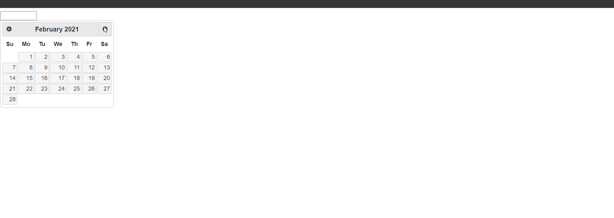

### Example 1

#### HTML

```HTML
<!DOCTYPE html>

<html>

	<head>

		<title>This is the title</title>

        <link href="style.css" rel="stylesheet" type="text/css" />

        <link href="jquery-ui.min.css" type="text/css" rel="stylesheet">

	</head>

<body>

    <input type="text" size="8" id="date" />

    <script src="jquery-3.2.1.min.js" type="text/javascript"></script>
    <script src="jquery-ui.min.js" type="text/javascript"></script>
    <script src="js.js" type="text/javascript"></script>

</body>

</html>
```

#### JavaScript

```JavaScript
$(document).ready(function () {

    $("#date").datepicker({

        dateFormat:"dd/mm/yy"//Day month Year.
    });

});

//dateFormat: mm/dd/yy = month day year this is default.
//dateFormat: yy/mm/dd = year month day.
//dateFormat: dd/mm    = day month and so on.
//We can also use -  and any symbols instead of "/"
//We can also use white spaces for this.

//dateFormat: is used to defind the type of the datePicker.
//The datepicker() is used to make datepickers.
```

### Output


### Example 2

#### HTML

```HTML
<!DOCTYPE html>

<html>

	<head>

		<title>This is the title</title>

        <link href="style.css" rel="stylesheet" type="text/css" />

        <link href="jquery-ui.min.css" type="text/css" rel="stylesheet">

	</head>

<body>

    <input type="text" size="8" id="date" />

    <script src="jquery-3.2.1.min.js" type="text/javascript"></script>
    <script src="jquery-ui.min.js" type="text/javascript"></script>
    <script src="js.js" type="text/javascript"></script>

</body>

</html>
```

#### JavaScript

```JavaScript
$(document).ready(function () {

    $("#date").datepicker({

        dateFormat:"yy mm dd"//year month day.
    });

});

//We use whiteSpace for this.
```

### Output

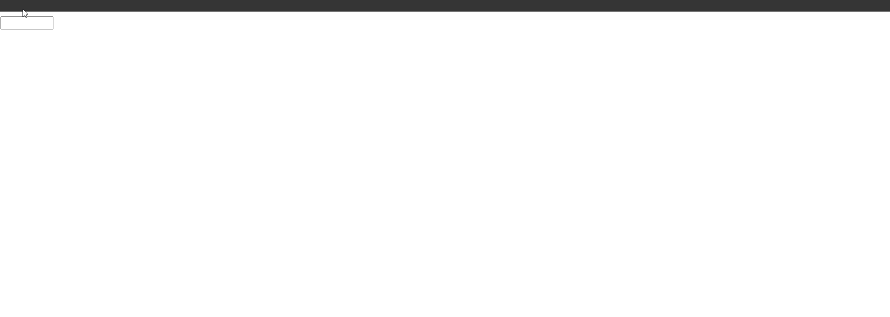

### Example 3

#### HTML

```HTML
<!DOCTYPE html>

<html>

	<head>

		<title>This is the title</title>

        <link href="style.css" rel="stylesheet" type="text/css" />

        <link href="jquery-ui.min.css" type="text/css" rel="stylesheet">

	</head>

<body>

    <input type="text" size="8" id="date" />

    <script src="jquery-3.2.1.min.js" type="text/javascript"></script>
    <script src="jquery-ui.min.js" type="text/javascript"></script>
    <script src="js.js" type="text/javascript"></script>

</body>

</html>
```

#### JavaScript

```JavaScript
(document).ready(function () {

    $("#date").datepicker({

        dateFormat:"yy-mm-dd"//year month day.
    });

});

//We use  for - for this.
```

### Output

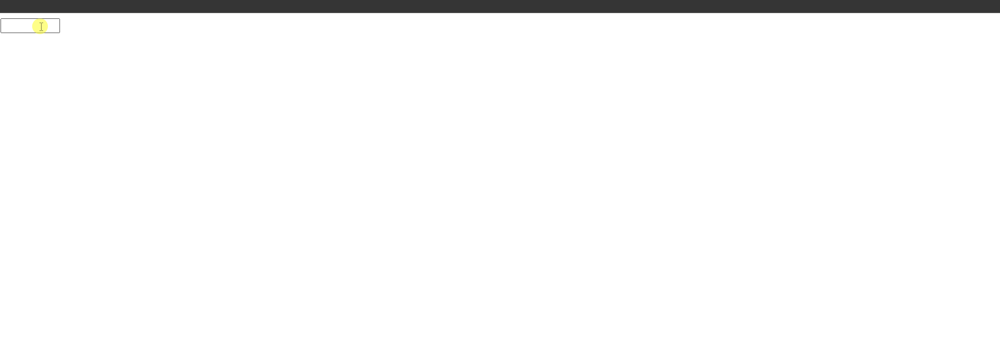

### Example 4

#### HTML

```HTML
<!DOCTYPE html>

<html>

	<head>

		<title>This is the title</title>

        <link href="style.css" rel="stylesheet" type="text/css" />

        <link href="jquery-ui.min.css" type="text/css" rel="stylesheet">

	</head>

<body>

    <input type="text" size="8" id="date" />

    <script src="jquery-3.2.1.min.js" type="text/javascript"></script>
    <script src="jquery-ui.min.js" type="text/javascript"></script>
    <script src="js.js" type="text/javascript"></script>

</body>

</html>
```

#### JavaScript

```JavaScript
$(document).ready(function () {

    $("#date").datepicker({

        dateFormat: "dd/mm/yy",
        minDate: 0,//0 is the current day(minimum day).so we can't pick a date before the current date.
        maxDate: 20//20 is maximum days so we can't pick a date after the 20 days forward.

    });

});

//minDate: is used to define the minimum date.
//maxDate: is used to define the maximum date.
//We can put it in the "0" string format ot numerical format.
//Within the current day and 20 days forward.We can pick date
```

### Output

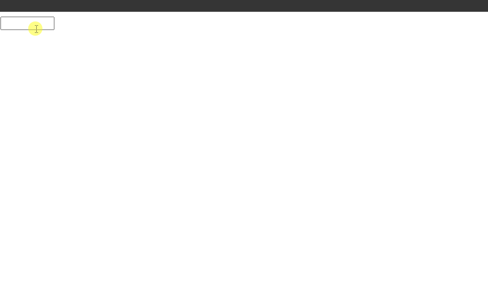

### Example 5

#### HTML

```HTML
<!DOCTYPE html>

<html>

	<head>

		<title>This is the title</title>

        <link href="style.css" rel="stylesheet" type="text/css" />

        <link href="jquery-ui.min.css" type="text/css" rel="stylesheet">

	</head>

<body>

    <input type="text" size="8" id="date" />

    <script src="jquery-3.2.1.min.js" type="text/javascript"></script>
    <script src="jquery-ui.min.js" type="text/javascript"></script>
    <script src="js.js" type="text/javascript"></script>

</body>

</html>
```

#### JavaScript

```JavaScript
$(document).ready(function () {

    $("#date").datepicker({

        dateFormat: "dd/mm/yy",
        minDate: "-1m -15d",//we can pick a date before 1 month and 15 days back form the current date.
        maxDate:15//we can pick only 15 days forward.

    });

});

//minDate: is used to define the minimum date.
//maxDate: is used to define the maximum date.
//We can put it in the "0" string format ot numerical format
//minDate:-1m -15d means backward 1 month and 15 days.
//maxDate:15 forward
```

### Output

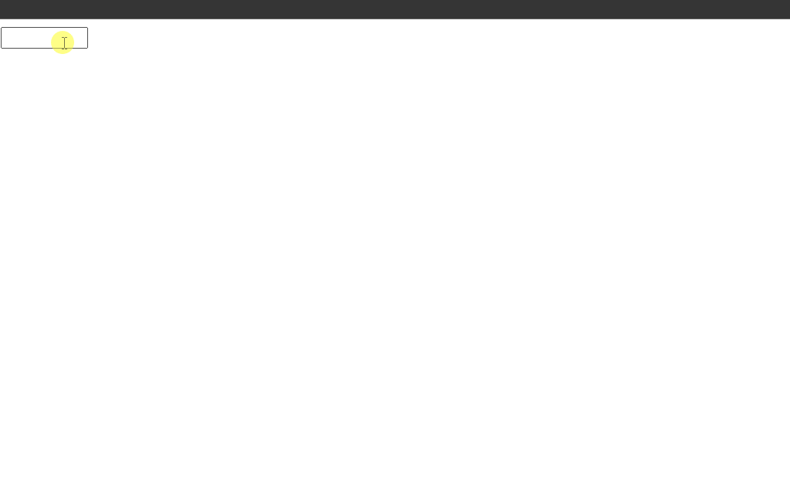

### Example 6

#### HTML

```HTML
<!DOCTYPE html>

<html>

	<head>

		<title>This is the title</title>

        <link href="style.css" rel="stylesheet" type="text/css" />

        <link href="jquery-ui.min.css" type="text/css" rel="stylesheet">

	</head>

<body>

    <input type="text" size="8" id="date" />

    <script src="jquery-3.2.1.min.js" type="text/javascript"></script>
    <script src="jquery-ui.min.js" type="text/javascript"></script>
    <script src="js.js" type="text/javascript"></script>

</body>

</html>
```

#### JavaScript

```JavaScript
$(document).ready(function () {

    $("#date").datepicker({

        dateFormat: "dd/mm/yy",
        minDate: "-1m -15d",//we can pick a date before 1 month and 15 days back form the current date.(backward)
        maxDate:"+1m +25"//we can pick 1 month and 25 days forward.(forward).

    });

});

//minDate: is used to define the minimum date.
//maxDate: is used to define the maximum date.
//We can put it in the "0" string format ot numerical format
//minDate:-1m -15d means backward 1 month and 15 days.
//maxDate:1 month and 25 day forward.
```

### Output

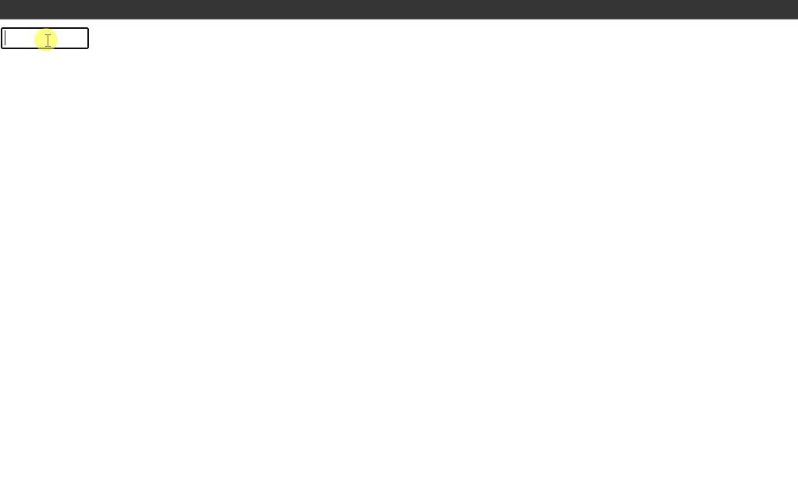

### Example 7

#### HTML

```HTML
<!DOCTYPE html>

<html>

	<head>

		<title>This is the title</title>

        <link href="style.css" rel="stylesheet" type="text/css" />

        <link href="jquery-ui.min.css" type="text/css" rel="stylesheet">

	</head>

<body>

    <input type="text" size="8" id="date" />

    <script src="jquery-3.2.1.min.js" type="text/javascript"></script>
    <script src="jquery-ui.min.js" type="text/javascript"></script>
    <script src="js.js" type="text/javascript"></script>

</body>

</html>
```

#### JavaScript

```JavaScript
$(document).ready(function () {

    $("#date").datepicker({

        dateFormat: "dd/mm/yy",
        showAnim:"bounce"//This is the animation.

    });

});

//There are many animations for this we can study everything in the jquery UI documentdation.
//There are lots of methods and effects in the jquery documentation you need to learn them.
```

### Output

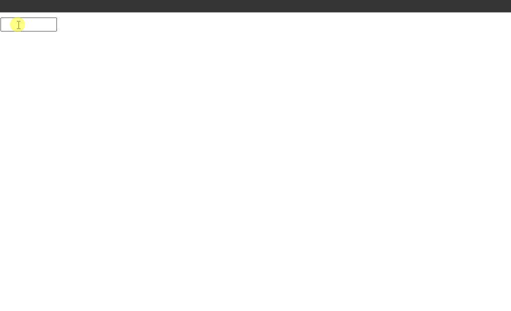

## 7. Dialog () Snippets

### Example 0

#### HTML

```HTML
<!DOCTYPE html>

<html>

	<head>

		<title>This is the title</title>

        <link href="style.css" rel="stylesheet" type="text/css" />

        <link href="jquery-ui.min.css" type="text/css" rel="stylesheet">

	</head>

<body>

    <input id="btnSave" type="button" value="Save" />

    <div id="dialog"></div>

    <script src="jquery-3.2.1.min.js" type="text/javascript"></script>
    <script src="jquery-ui.min.js" type="text/javascript"></script>
    <script src="js.js" type="text/javascript"></script>

</body>

</html>
```

#### JavaScript

```JavaScript
$(document).ready(function () {

    $("#btnSave").click(function () {

        $("#dialog").attr("title", "Saved").text("It has been changed").dialog();

    });

});

//dialog() is used to make an dialog box.
//you need a div element fot a dialog box.
//The title attribute is the heading.
//The text() is the content or messagea.
//we can also give dicretly the title value and text value in the html.
//But here i heve put everthings as programmtically.
//We need to put the word dialog() before the div element that will automatically make a dialog box.
```

### Output


### Example 1

#### HTML

```HTML
<!DOCTYPE html>

<html>

	<head>

		<title>This is the title</title>

        <link href="style.css" rel="stylesheet" type="text/css" />

        <link href="jquery-ui.min.css" type="text/css" rel="stylesheet">

	</head>

<body>

    <input id="btnSave" type="button" value="Save" />

    <div id="dialog"></div>

    <script src="jquery-3.2.1.min.js" type="text/javascript"></script>
    <script src="jquery-ui.min.js" type="text/javascript"></script>
    <script src="js.js" type="text/javascript"></script>

</body>

</html>
```

#### JavaScript

```JavaScript
$(document).ready(function () {

    $("#btnSave").click(function () {

        $("#dialog").attr("title", "Saved").text("It has been saved").dialog({

            buttons: {

                ok: function () {

                    $(this).dialog("close");//This means current ok event.
                    alert("MSG has been sent to server");

					//We can put the ajax request here or other things.
                },
                cancel: function () {

                    $(this).dialog("close");
                }
            }

        });

    });

});

//If you want to make any buttons in the dialog box.you need make an object called buttons{}
//inside the buttons{} object we can create our buttons "ok" or "cancel" like that.
//Each buttons should have a function like above.
//dialog("close") is to close the dialog box.
```

### Output

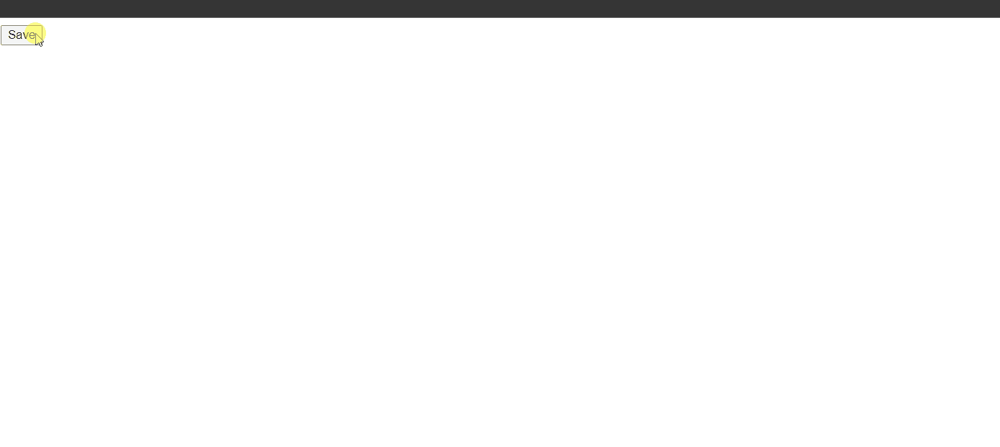

### Example 2

#### HTML

```HTML
<!DOCTYPE html>

<html>

	<head>

		<title>This is the title</title>

        <link href="style.css" rel="stylesheet" type="text/css" />

        <link href="jquery-ui.min.css" type="text/css" rel="stylesheet">

	</head>

<body>

    <input id="btnSave" type="button" value="Save" />

    <div id="dialog"></div>

    <script src="jquery-3.2.1.min.js" type="text/javascript"></script>
    <script src="jquery-ui.min.js" type="text/javascript"></script>
    <script src="js.js" type="text/javascript"></script>

</body>

</html>
```

#### JavaScript

```JavaScript
$(document).ready(function () {

    $("#btnSave").click(function () {

        $("#dialog").attr("title", "Saved").text("It has been saved").dialog({

            buttons: {

                ok: function () {

                    $(this).dialog("close");//This means current function.
                    alert("MSG has been sent to server");
                },
                cancel: function () {

                    $(this).dialog("close");
                }
            },
            draggable:false,//User can't drag the dialog box.
            resizable:false//User can't rizse the dialog box.
        });

    });

});

//you can draggable:false so the user cannot dragg the dialog box.
//Make sure buttons{} is an entire object that is in the dialog main object.
//resizable:false user cannot resize the box.
//by default the user can resize or drag the dialog box.
```

### Output


### Example 3

#### HTML

```HTML
<!DOCTYPE html>

<html>

	<head>

		<title>This is the title</title>

        <link href="style.css" rel="stylesheet" type="text/css" />

        <link href="jquery-ui.min.css" type="text/css" rel="stylesheet">

	</head>

<body>

    <input id="btnSave" type="button" value="Save" />

    <div id="dialog"></div>

    <script src="jquery-3.2.1.min.js" type="text/javascript"></script>
    <script src="jquery-ui.min.js" type="text/javascript"></script>
    <script src="js.js" type="text/javascript"></script>

</body>

</html>
```

#### JavaScript

```JavaScript
$(document).ready(function () {

    $("#btnSave").click(function () {


        $("#dialog").text("This is a message").attr("title", "Saved").dialog({

            buttons: {//These are the buttons.

                Ok: function () {

                    $(this).dialog("close");
                    alert("MSG has been sent");

                },
                Cancel: function () {

                    $(this).dialog("close");

                }

            },
            draggable: false,//no draggable
            resizable: false,//no resizable
            show:"bounce"//show is the animation type.

        });

    });
});

//There are lots of animation types in the jquery ui document.
//Go and study everything.
```

### Output


### Example 4

#### HTML

```HTML
<!DOCTYPE html>

<html>

	<head>

		<title>This is the title</title>

        <link href="style.css" rel="stylesheet" type="text/css" />

        <link href="jquery-ui.min.css" type="text/css" rel="stylesheet">

	</head>

<body>

    <input id="btnSave" type="button" value="Save" />

    <div id="dialog"></div>

    <script src="jquery-3.2.1.min.js" type="text/javascript"></script>
    <script src="jquery-ui.min.js" type="text/javascript"></script>
    <script src="js.js" type="text/javascript"></script>

</body>

</html>
```

#### JavaScript

```JavaScript
$(document).ready(function () {

    $("#btnSave").click(function () {

        $("#dialog").attr("title", "saved").text("HelloWorld").dialog({

            buttons: {//buttons

                ok: function () {

                    $(this).dialog("close");

                }
            },
            draggable: false,//no draggable
            resizable: false,//no resizable
            show: "fadeIn",//fadeIn aniamtion
            modal:true//This is goning to make the background as transprent.cann't click or accsess anything in the bacground.

        });

    });

});
```

### Output


## 8. Progressbar () Snippets

### Example 0

#### HTML

```HTML
<!DOCTYPE html>

<html>

	<head>

		<title>This is the title</title>

        <link href="style.css" rel="stylesheet" type="text/css" />

        <link href="jquery-ui.min.css" type="text/css" rel="stylesheet">

	</head>

<body>

    <input type="button" id="btn" value="Start" />

    <div id="pb">

    </div>
    <div id="p"></div>

    <script src="jquery-3.2.1.min.js" type="text/javascript"></script>
    <script src="jquery-ui.min.js" type="text/javascript"></script>
    <script src="js.js" type="text/javascript"></script>

</body>

</html>
```

#### JavaScript

```JavaScript
$(document).ready(function () {

    $("#btn").click(function () {

        $("#pb").progressbar();

    });

});

//progressbar() makes an progressbar.
```

### Output

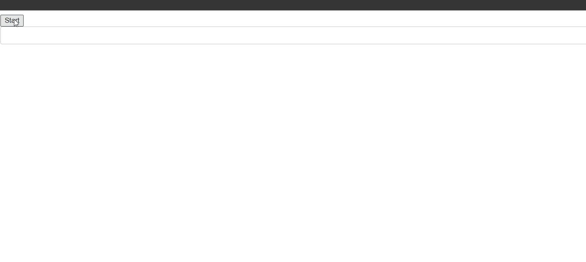

### Example 1

#### HTML

```HTML
<!DOCTYPE html>

<html>

	<head>

		<title>This is the title</title>

        <link href="style.css" rel="stylesheet" type="text/css" />

        <link href="jquery-ui.min.css" type="text/css" rel="stylesheet">

	</head>

<body>

    <input type="button" id="btn" value="Start" />

    <div id="pb">

    </div>
    <div id="p"></div>

    <script src="jquery-3.2.1.min.js" type="text/javascript"></script>
    <script src="jquery-ui.min.js" type="text/javascript"></script>
    <script src="js.js" type="text/javascript"></script>

</body>

</html>
```

#### JavaScript

```JavaScript
$(document).ready(function () {

    $("#btn").click(function () {

        $("#pb").progressbar({value:50});

    });

});

//progressbar() makes an progressbar.
//we can specify the value im the value obj.
```

### Output


### Example 2

#### HTML

```HTML
<!DOCTYPE html>

<html>

	<head>

		<title>This is the title</title>

        <link href="style.css" rel="stylesheet" type="text/css" />

        <link href="jquery-ui.min.css" type="text/css" rel="stylesheet">

	</head>

<body>

    <input type="button" id="btn" value="Start" />

    <div id="pb">

    </div>
    <div id="p"></div>

    <script src="jquery-3.2.1.min.js" type="text/javascript"></script>
    <script src="jquery-ui.min.js" type="text/javascript"></script>
    <script src="js.js" type="text/javascript"></script>

</body>

</html>
```

#### JavaScript

```JavaScript
$(document).ready(function () {

    $("#btn").click(function () {

        var val = 0;//This is the value.

         inter = setInterval(function () {//every 50 milli second this function will run.

            val++;//increse one by one every 50 millisecond.

            $("#pb").progressbar({ value: val });//Dynamically change it's value.

            $("#p").text(val + "%");//This is for displaying purpose.

            if (val == 50) {//if the value hits 50 stop it.
                clearInterval(inter);
            }

        }, 50);

    });

});
```

### Output


