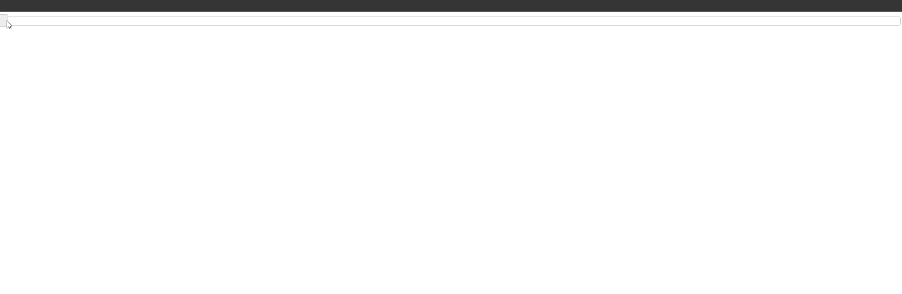
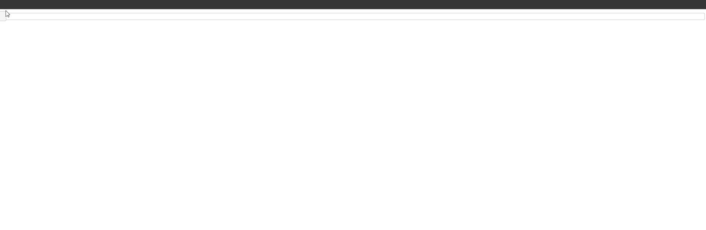
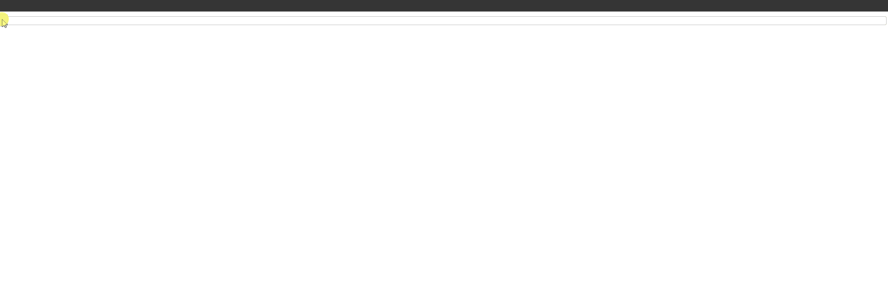
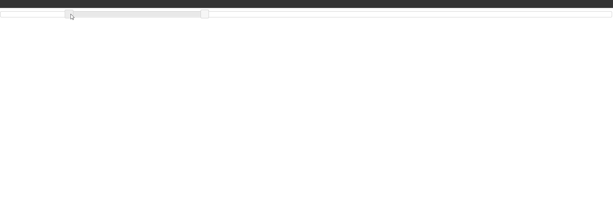
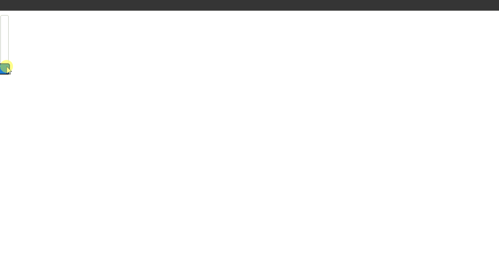
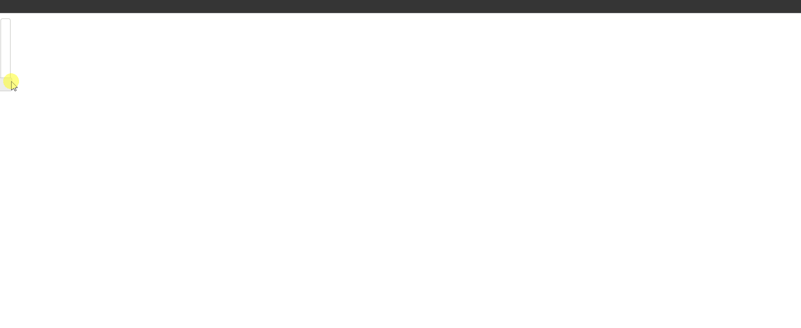
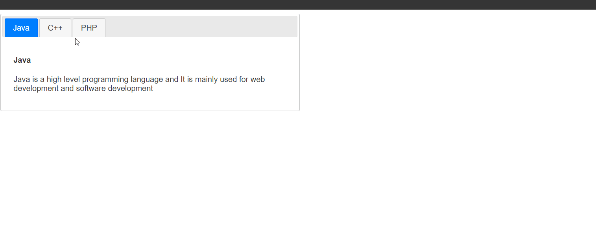
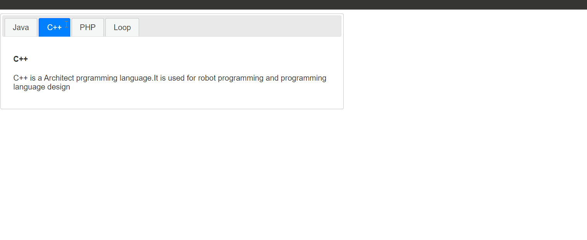
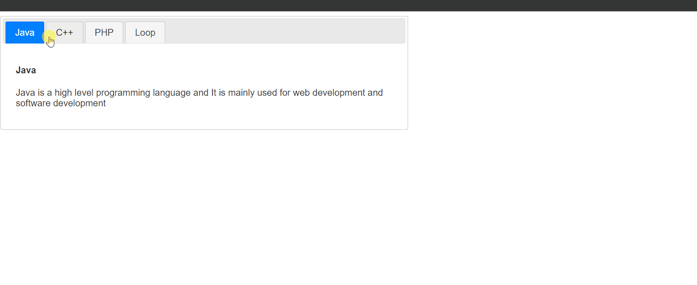
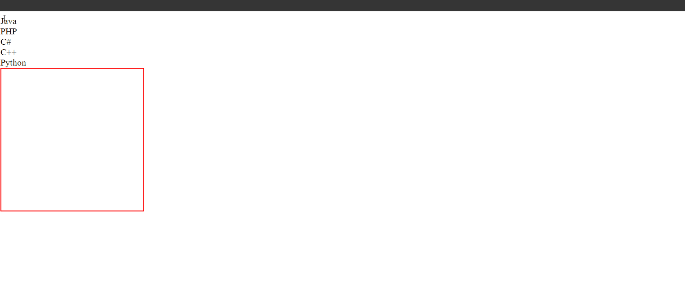

## 9. Slider () Snippets

### Example 0

#### HTML

```HTML
<!DOCTYPE html>

<html>

	<head>

		<title>This is the title</title>

        <link href="style.css" rel="stylesheet" type="text/css" />

        <link href="jquery-ui.min.css" type="text/css" rel="stylesheet">

	</head>

<body>

    <div id="slider">

    </div>

    <div id="slider_value"></div>
    <script src="jquery-3.2.1.min.js" type="text/javascript"></script>
    <script src="jquery-ui.min.js" type="text/javascript"></script>
    <script src="js.js" type="text/javascript"></script>

</body>

</html>
```

#### JavaScript

```JavaScript
$(document).ready(function () {

    $("#slider").slider();

});
```

### Output



### Example 1

#### HTML

```HTML
<!DOCTYPE html>

<html>

	<head>

		<title>This is the title</title>

        <link href="style.css" rel="stylesheet" type="text/css" />

        <link href="jquery-ui.min.css" type="text/css" rel="stylesheet">

	</head>

<body>

    <div id="slider">

    </div>

    <div id="slider_value"></div>

    <script src="jquery-3.2.1.min.js" type="text/javascript"></script>
    <script src="jquery-ui.min.js" type="text/javascript"></script>
    <script src="js.js" type="text/javascript"></script>

</body>

</html>
```

#### JavaScript

```JavaScript
$(document).ready(function () {

    $("#slider").slider({

        slide: function (event,ui) {

            $("#slider_value").html("&pound;"+ui.value);//We put $pound; so we must use html() not text() text() is for texts.

        }
    });

});

//slide is a function is to check the values and it takes two perameters like above.
```

### Output



### Example 2

#### HTML

```HTML
<!DOCTYPE html>

<html>

	<head>

		<title>This is the title</title>

        <link href="style.css" rel="stylesheet" type="text/css" />

        <link href="jquery-ui.min.css" type="text/css" rel="stylesheet">

	</head>

<body>

    <div id="slider">

    </div>

    <div id="slider_value"></div>

    <script src="jquery-3.2.1.min.js" type="text/javascript"></script>
    <script src="jquery-ui.min.js" type="text/javascript"></script>
    <script src="js.js" type="text/javascript"></script>

</body>

</html>
```

#### JavaScript

```JavaScript
$(document).ready(function () {

    var min_val = 20;
    var max_val = 200;

    $("#slider").slider({

        min: min_val,//This is the minimum value
        max: max_val,//This the maximum value.
        step:5,//setp is the step that we want to go.

        slide: function (event,ui) {//This is the function to check the value dynamically.

            $("#slider_value").html("&pound;"+ui.value);//We put $pound; so we must use html() not text() text() is for texts.

        }
    });

});

//slide is a function is to check the values and it takes two perameters like above.
```

### Output



### Example 3

#### HTML

```HTML
<!DOCTYPE html>

<html>

	<head>

		<title>This is the title</title>

        <link href="style.css" rel="stylesheet" type="text/css" />

        <link href="jquery-ui.min.css" type="text/css" rel="stylesheet">

	</head>

<body>

    <div id="slider">

    </div>

    <div id="slider_value"></div>

    <script src="jquery-3.2.1.min.js" type="text/javascript"></script>
    <script src="jquery-ui.min.js" type="text/javascript"></script>
    <script src="js.js" type="text/javascript"></script>

</body>

</html>
```

#### JavaScript

```JavaScript
$(document).ready(function () {

    var min_val = 20;
    var max_val = 200;

    $("#slider").slider({

        min: min_val,//This is the minimum value
        max: max_val,//This the maximum value.
        range: true,//The range is use to give a certain ammount of values to choose from.
        values:[40,80],//I heve selected 40 to 80.

        slide: function (event,ui) {//This is the function to check the value dynamically.

            $("#slider_value").html("&pound;"+ui.values[0]+" &pound"+ui.values[1]);//ui.values[0] is the first slider button ui.values[1] is the second slider button.

        }
    });

});

//slide is a function is to check the values and it takes two perameters like above.
//But still we can select backward and forward.
```

### Output



### Example 4

#### HTML

```HTML
<!DOCTYPE html>

<html>

	<head>

		<title>This is the title</title>

        <link href="style.css" rel="stylesheet" type="text/css" />

        <link href="jquery-ui.min.css" type="text/css" rel="stylesheet">

	</head>

<body>

    <div id="slider">

    </div>

    <div id="slider_value"></div>

    <script src="jquery-3.2.1.min.js" type="text/javascript"></script>
    <script src="jquery-ui.min.js" type="text/javascript"></script>
    <script src="js.js" type="text/javascript"></script>

</body>

</html>
```

#### JavaScript

```JavaScript
$(document).ready(function () {

    var min_val = 20;
    var max_val = 100;

    $("#slider").slider({

        min: min_val,//This is the minimum value
        max: max_val,//This the maximum value.

        slide: function (event,ui) {//This is the function to check the value dynamically.

            $("#slider_value").html(ui.value);//ui.values[0] is the first slider button ui.values[1] is the second slider button.

        },
        orientation:"vertical"//This will make the slider bar as vertical.
    });

});

//slide is a function is to check the values and it takes two perameters like above.
//But still we can select backward and forward.
```

### Output



### Example 5

#### HTML

```HTML
<!DOCTYPE html>

<html>

	<head>

		<title>This is the title</title>

        <link href="style.css" rel="stylesheet" type="text/css" />

        <link href="jquery-ui.min.css" type="text/css" rel="stylesheet">

	</head>

<body>

    <div id="slider">

    </div>

    <div id="slider_value"></div>

    <script src="jquery-3.2.1.min.js" type="text/javascript"></script>
    <script src="jquery-ui.min.js" type="text/javascript"></script>
    <script src="js.js" type="text/javascript"></script>

</body>

</html>
```

#### JavaScript

```JavaScript
$(document).ready(function () {

    var min_val = 20;
    var max_val = 100;

    $("#slider").slider({

        min: min_val,//This is the minimum value
        max: max_val,//This the maximum value.

        slide: function (event,ui) {//This is the function to check the value dynamically.

            $("#slider_value").html(ui.value);//ui.values[0] is the first slider button ui.values[1] is the second slider button.

        },
        orientation:"vertical",//This will make the slider bar as vertical.

        stop: function (event, ui) {//This is run the user stop the slider.

            alert("You have stop at " + ui.value);

        }
    });

});

//slide is a function is to check the values and it takes two perameters like above.
//But still we can select backward and forward.
```

### Output



## 10. Tabs () Snippets

### Example 0

#### HTML

```HTML
<!DOCTYPE html>

<html>

<head>

	<title>This is the title</title>

	<link href="style.css" rel="stylesheet" type="text/css" />

	<link href="jquery-ui.min.css" type="text/css" rel="stylesheet">

</head>

<body>

    <div id="tabs">

        <ul>

            <li><a href="#java">Java</a></li>
            <li><a href="#c++">C++</a></li>
            <li><a href="#php">PHP</a></li>

        </ul>

        <div id="java">

            <h4>Java</h4>

            <p>Java is a high level programming language and It is mainly used for web development and software development</p>

        </div>

        <div id="c++">

            <h4>C++</h4>
            <p>C++ is a Architect prgramming language.It is used for robot programming and programming language design</p>

        </div>

        <div id="php">

            <h4>PHP</h4>

            <p>PhP is server side scripting language it is mainly used for server matinrances</p>

        </div>

    </div>

    <script src="jquery-3.2.1.min.js" type="text/javascript"></script>
    <script src="jquery-ui.min.js" type="text/javascript"></script>
    <script src="js.js" type="text/javascript"></script>

</body>

</html>
```

#### CSS

```CSS
#tabs {

    width:600px;

}
```

#### JavaScript

```JavaScript
$(document).ready(function () {

    $("#tabs").tabs();

});

//The single word tabs() makes a tab.
```

### Output



### Example 1

#### HTML

```HTML
<!DOCTYPE html>

<html>

<head>

	<title>This is the title</title>

	<link href="style.css" rel="stylesheet" type="text/css" />

	<link href="jquery-ui.min.css" type="text/css" rel="stylesheet">

</head>

<body>

    <div id="tabs">

        <ul>

            <li><a href="#java">Java</a></li>
            <li><a href="#c++">C++</a></li>
            <li><a href="#php">PHP</a></li>
            <li><a href="loop.php">Loop</a></li>

        </ul>

        <div id="java">

            <h4>Java</h4>

            <p>Java is a high level programming language and It is mainly used for web development and software development</p>

        </div>

        <div id="c++">

            <h4>C++</h4>
            <p>C++ is a Architect prgramming language.It is used for robot programming and programming language design</p>

        </div>

        <div id="php">

            <h4>PHP</h4>

            <p>PhP is server side scripting language it is mainly used for server matinrances</p>

        </div>

    </div>

    <script src="jquery-3.2.1.min.js" type="text/javascript"></script>
    <script src="jquery-ui.min.js" type="text/javascript"></script>
    <script src="js.js" type="text/javascript"></script>

</body>

</html>
```

#### CSS

```CSS
#tabs {

    width:700px;

}
```

#### JavaScript

```JavaScript
$(document).ready(function () {

    $("#tabs").tabs({

        ajaxOptions: {

            error: function (xhr,index,status, anchor) {

                $(anchor.hash).text("Page Could not load");
            }

        }

    });

});

//Inside the ajaxOptions we can specify error and other options.
//If the php file has en error error function will run.
```

#### PHP

```PHP
<?php

for($x=0;$x<10;$x++){

	echo $x,"<br />";

}

?>
```

### Output


### Example 2

#### HTML

```HTML
<!DOCTYPE html>

<html>

<head>

	<title>This is the title</title>

	<link href="style.css" rel="stylesheet" type="text/css" />

	<link href="jquery-ui.min.css" type="text/css" rel="stylesheet">

</head>

<body>

    <div id="tabs">

        <ul>

            <li><a href="#java">Java</a></li>
            <li><a href="#c++">C++</a></li>
            <li><a href="#php">PHP</a></li>
            <li><a href="loop.php">Loop</a></li>

        </ul>

        <div id="java">

            <h4>Java</h4>

            <p>Java is a high level programming language and It is mainly used for web development and software development</p>

        </div>

        <div id="c++">

            <h4>C++</h4>
            <p>C++ is a Architect prgramming language.It is used for robot programming and programming language design</p>

        </div>

        <div id="php">

            <h4>PHP</h4>

            <p>PhP is server side scripting language it is mainly used for server matinrances</p>

        </div>

    </div>

    <script src="jquery-3.2.1.min.js" type="text/javascript"></script>
    <script src="jquery-ui.min.js" type="text/javascript"></script>
    <script src="js.js" type="text/javascript"></script>

</body>

</html>
```

#### CSS

```CSS
#tabs {

    width:700px;

}
```

#### JavaScript

```JavaScript
$(document).ready(function () {

    $("#tabs").tabs({ event: "mouseover" });

});
//The event method specify the event that we want to assign.
```

#### PHP

```PHP
<?php

for($x=0;$x<10;$x++){

	echo $x,"<br />";

}

?>
```

### Output



### Example 3

#### HTML

```HTML
<!DOCTYPE html>

<html>

<head>

	<title>This is the title</title>

	<link href="style.css" rel="stylesheet" type="text/css" />

	<link href="jquery-ui.min.css" type="text/css" rel="stylesheet">

</head>

<body>

    <div id="tabs">

        <ul>

            <li><a href="#java">Java</a></li>
            <li><a href="#c++">C++</a></li>
            <li><a href="#php">PHP</a></li>
            <li><a href="loop.php">Loop</a></li>

        </ul>

        <div id="java">

            <h4>Java</h4>

            <p>Java is a high level programming language and It is mainly used for web development and software development</p>

        </div>

        <div id="c++">

            <h4>C++</h4>
            <p>C++ is a Architect prgramming language.It is used for robot programming and programming language design</p>

        </div>

        <div id="php">

            <h4>PHP</h4>

            <p>PhP is server side scripting language it is mainly used for server matinrances</p>

        </div>

    </div>

    <script src="jquery-3.2.1.min.js" type="text/javascript"></script>
    <script src="jquery-ui.min.js" type="text/javascript"></script>
    <script src="js.js" type="text/javascript"></script>

</body>

</html>
```

#### CSS

```CSS
#tabs {

    width:700px;

}
```

#### JavaScript

```JavaScript
$(document).ready(function () {

    $("#tabs").tabs({ collapsible:true});

});

//The collapsible is used to collapse the tab.
```

#### PHP

```PHP
<?php

for($x=0;$x<10;$x++){

	echo $x,"<br />";

}

?>
```

### Output



### Example 4

#### HTML

```HTML
<!DOCTYPE html>

<html>

<head>

	<title>This is the title</title>

	<link href="style.css" rel="stylesheet" type="text/css" />

	<link href="jquery-ui.min.css" type="text/css" rel="stylesheet">

</head>

<body>

    <div id="tabs">

        <ul class="btns">

            <li><a href="#java">Java</a></li>
            <li><a href="#c++">C++</a></li>
            <li><a href="#php">PHP</a></li>
            <li><a href="loop.php">Loop</a></li>

        </ul>

        <div id="java">

            <h4>Java</h4>

            <p>Java is a high level programming language and It is mainly used for web development and software development</p>

        </div>

        <div id="c++">

            <h4>C++</h4>
            <p>C++ is a Architect prgramming language.It is used for robot programming and programming language design</p>

        </div>

        <div id="php">

            <h4>PHP</h4>

            <p>PhP is server side scripting language it is mainly used for server matinrances</p>

        </div>

    </div>

    <script src="jquery-3.2.1.min.js" type="text/javascript"></script>
    <script src="jquery-ui.min.js" type="text/javascript"></script>
    <script src="js.js" type="text/javascript"></script>

</body>

</html>
```

#### CSS

```CSS
#tabs {

    width:700px;

}
```

#### JavaScript

```JavaScript
$(document).ready(function () {

    $("#tabs").tabs().find(".btns").sortable();

});

//The sortable() allows the user to rearrange the btns dynamically.
//We have only apply this sortable() method to btns
//We have used find() method to find the .btns
```

#### PHP

```PHP
<?php

for($x=0;$x<10;$x++){

	echo $x,"<br />";

}

?>
```

### Output


## 11. Drag and Drop Application Snippets

### Example 0

#### HTML

```HTML
<!DOCTYPE html>

<html>

	<head>

		<title>This is the title</title>

     <link href="style.css" rel="stylesheet" type="text/css" />

	</head>

<body>

          <span class="item">Java</span><br />
          <span class="item">PHP</span><br />
          <span class="item">C#</span><br />
          <span class="item">C++</span><br />
          <span class="item">Python</span><br />

<div id="box"></div>

    <script src="jquery-3.2.1.min.js" type="text/javascript"></script>
    <script src="jquery-ui.min.js" type="text/javascript"></script>
    <script src="js.js" type="text/javascript"></script>

</body>

</html>
```

#### CSS

```CSS
#box{

    width: 250px;
    height: 250px;
    border: 2px solid red;

}

ul li{

    list-style-type: none;

}

#box.border{

    border-width: 10px;

}
```

#### JavaScript

```JavaScript
$(document).ready(function () {

    $(".item").draggable({

    revert:true,

        start:function(){

            contant=$(this).text();//Globel variable.

        }

    });

    $("#box").droppable({

        hoverClass:"border",
        accept: ".item",
        drop: function () {


            $("#box").append(contant + "<br />");

        }        

    });    
});
```

### Output


