## 1. Sortable () Snippets

### Example 0

#### HTML

```HTML
<!DOCTYPE html>

<html>

	<head>

		<title>This is the title</title>

        <link  rel="stylesheet" href="jquery-ui.min.css" type="text/css" />

        <link href="style.css" rel="stylesheet" type="text/css" />

	</head>

<body>

    <div id="box1">

        <p class="item1">This is joker</p>
        <p class="item1">This is kuna</p>
        <p class="item1">This is rakulan</p>
        <p class="item1">This is menan</p>
        <p class="item1">This is Pragase</p>
        <p class="item1">This is Jathu</p>
        <p class="item1">This is Suba</p>

    </div>

    <div id="box2">
        <p class="item2">This is suresh</p>
        <p class="item2">This is joy</p>
        <p class="item2">This is rakulan</p>
        <p class="item2">This is menan</p>
        <p class="item2">This is Pragase</p>
        <p class="item2">This is Jathu</p>
        <p class="item2">This is Suba</p>

    </div>

    <script src="jquery-3.2.1.min.js" type="text/javascript"></script>
    <script src="jquery-ui.min.js" type="text/javascript"></script>

    <script src="js.js" type="text/javascript"></script>

</body>

</html>
```

#### CSS

```CSS
#box1{

    width:250px;
    height:auto;
    border:1px solid red;
    position:relative;
    top:300px;

}
#box2{

    width:250px;
    height:auto;
    border:1px solid red;
   position:relative;
   left:350px;

}
```

#### JavaScript

```JavaScript
$(document).ready(function () {

    $("#box1").sortable({

        connectWith:"#box2"

    });

    $("#box2").sortable({

        connectWith:"#box1"

    });

});

//The sortable() aollows to sort within boxes.
//connectWith is used to connects with others.
```

### Output


### Example 1

#### HTML

```HTML
<!DOCTYPE html>

<html>

	<head>

		<title>This is the title</title>

        <link  rel="stylesheet" href="jquery-ui.min.css" type="text/css" />

        <link href="style.css" rel="stylesheet" type="text/css" />

	</head>

<body>

    <div id="box1">

        <p class="item1">This is joker</p>
        <p class="item1">This is kuna</p>
        <p class="item1">This is rakulan</p>
        <p class="item1">This is menan</p>
        <p class="item1">This is Pragase</p>
        <p class="item1">This is Jathu</p>
        <p class="item1">This is Suba</p>

    </div>

    <div id="box2">
        <p class="item2">This is suresh</p>
        <p class="item2">This is joy</p>
        <p class="item2">This is rakulan</p>
        <p class="item2">This is menan</p>
        <p class="item2">This is Pragase</p>
        <p class="item2">This is Jathu</p>
        <p class="item2">This is Suba</p>

    </div>

    <div id="box3">
        <p class="item2">This is suresh</p>
        <p class="item2">This is joy</p>
        <p class="item2">This is rakulan</p>
        <p class="item2">This is menan</p>
        <p class="item2">This is Pragase</p>
        <p class="item2">This is Jathu</p>
        <p class="item2">This is Suba</p>

    </div>

    <script src="jquery-3.2.1.min.js" type="text/javascript"></script>
    <script src="jquery-ui.min.js" type="text/javascript"></script>

    <script src="js.js" type="text/javascript"></script>

</body>

</html>
```

#### CSS

```CSS
#box1{

    width:250px;
    height:auto;
    border:1px solid red;
    position:relative;
    top:260px;

}
#box2{

    width:250px;
    height:auto;
    border:1px solid red;
   position:relative;
   left:350px;

}

#box3{

    width:250px;
    height:auto;
    border:1px solid red;
   position:relative;
   left:650px;
   top:-250px;

}
```

#### JavaScript

```JavaScript
$(document).ready(function () {

    $("#box1").sortable({

        connectWith:"#box2,#box3"

    });

    $("#box2").sortable({

        connectWith:"#box1,#box3"

    });

    $("#box3").sortable({

        connectWith:"#box1,#box2"
    });
});

//The sortable() aollows to sort within boxes.
//connectWith is used to connects with others.
//we can connect more at one time by using a comma.
```

### Output


### Example 2

#### HTML

```HTML
<!DOCTYPE html>

<html>

	<head>

		<title>This is the title</title>

        <link  rel="stylesheet" href="jquery-ui.min.css" type="text/css" />

        <link href="style.css" rel="stylesheet" type="text/css" />

	</head>

<body>

    <div id="box1">

        <p class="item1">The List 1</p>
        <p class="item1">The List 2</p>
        <p class="item1">The List 3</p>
        <p class="item1">The List 4</p>
        <p class="item1">The List 5</p>
        <p class="item1">The List 6</p>
        <p class="item1">The List 7</p>

    </div>

    <script src="jquery-3.2.1.min.js" type="text/javascript"></script>
    <script src="jquery-ui.min.js" type="text/javascript"></script>

    <script src="js.js" type="text/javascript"></script>

</body>

</html>
```

#### CSS

```CSS
#box1{

    width:250px;
    height:auto;
    border:1px solid red;

}
```

#### JavaScript

```JavaScript
$(document).ready(function () {

    $("#box1").sortable({

        containment: "#box1"//document parent #box

    });

});

//The containment is the place that the list items can be sort or drag.
```

### Output


### Example 3

#### HTML

```HTML
<!DOCTYPE html>

<html>

	<head>

		<title>This is the title</title>

        <link  rel="stylesheet" href="jquery-ui.min.css" type="text/css" />

        <link href="style.css" rel="stylesheet" type="text/css" />

	</head>

<body>

    <ul id="lists">

        <li>list 1</li>
        <li>list 2</li>
        <li>list 3</li>
        <li>list 4</li>
        <li>list 5</li>
        <li>list 6</li>

    </ul>

    <script src="jquery-3.2.1.min.js" type="text/javascript"></script>
    <script src="jquery-ui.min.js" type="text/javascript"></script>

    <script src="js.js" type="text/javascript"></script>

</body>

</html>
```

#### CSS

```CSS
ul li {
    list-style-type:none;
}
```

#### JavaScript

```JavaScript
$(document).ready(function () {

    $("#lists").sortable({

    });

});
```

### Output


### Example 4

#### HTML

```HTML
<!DOCTYPE html>

<html>

	<head>

		<title>This is the title</title>

        <link  rel="stylesheet" href="jquery-ui.min.css" type="text/css" />

        <link href="style.css" rel="stylesheet" type="text/css" />

	</head>

<body>

    <ul id="lists">

        <li>list 1</li>
        <li>list 2</li>
        <li>list 3</li>
        <li>list 4</li>
        <li>list 5</li>
        <li>list 6</li>

    </ul>

    <script src="jquery-3.2.1.min.js" type="text/javascript"></script>
    <script src="jquery-ui.min.js" type="text/javascript"></script>

    <script src="js.js" type="text/javascript"></script>

</body>

</html>
```

#### CSS

```CSS
ul li {
    list-style-type:none;
}
```

#### JavaScript

```JavaScript
$(document).ready(function () {

    $("#lists").sortable({

       axis:"y"//This only allows to sort vertically.
    });

});
```

### Output


## 2. Accordion () Snippets

### Example 0

#### HTML

```HTML
<!DOCTYPE html>

<html>

	<head>

		<title>This is the title</title>

        <link  rel="stylesheet" href="jquery-ui.min.css" type="text/css" />

        <link href="style.css" rel="stylesheet" type="text/css" />

	</head>

<body>

    <div id="accordion">

      <h1>Java</h1>

        <div id="ac1">

            <p>Java is a best programming language that you can use language for ever</p>
        </div>

        <h1>C++</h1>

        <div id="ac2">

            <p>This is c++.It is the big power full programming language</p>
        </div>
        <h1>C</h1>

        <div id="ac2">

            <p>This is c.It is the big power full programming language</p>
        </div>

    </div>

    <script src="jquery-3.2.1.min.js" type="text/javascript"></script>
    <script src="jquery-ui.min.js" type="text/javascript"></script>

    <script src="js.js" type="text/javascript"></script>

</body>

</html>
```

#### JavaScript

```JavaScript
$(function () {//This is the shotcut for document load.

    $("#accordion").accordion();

});

//the accordion takes the first html element as heading then the secound element will be the contant box.
```

### Output

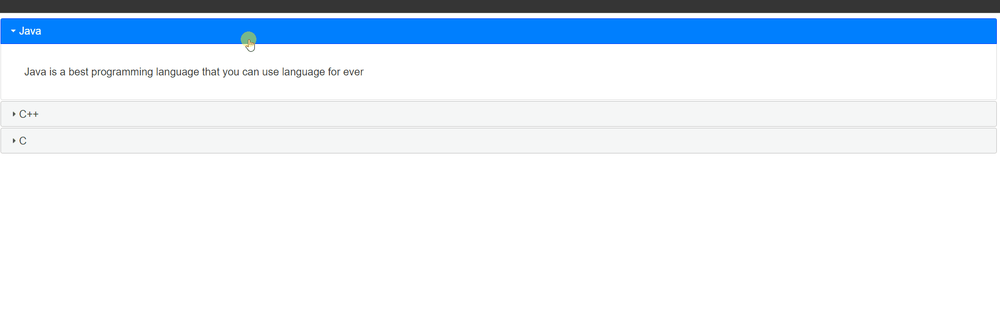

### Example 1

#### HTML

```HTML
<!DOCTYPE html>

<html>

	<head>
		<title>This is the title</title>

        <link  rel="stylesheet" href="jquery-ui.min.css" type="text/css" />

        <link href="style.css" rel="stylesheet" type="text/css" />

	</head>

<body>

    <div id="accordion">

      <h1>Java</h1>

        <div id="ac1">

            <p>Java is a best programming language that you can use language for ever</p>
        </div>

        <h1>C++</h1>

        <div id="ac2">

            <p>This is c++.It is the big power full programming language</p>
        </div>
        <h1>C</h1>

        <div id="ac2">

            <p>This is c.It is the big power full programming language</p>
        </div>

    </div>

    <script src="jquery-3.2.1.min.js" type="text/javascript"></script>
    <script src="jquery-ui.min.js" type="text/javascript"></script>

    <script src="js.js" type="text/javascript"></script>

</body>

</html>
```

#### JavaScript

```JavaScript
$(function () {//This is the shotcut for document load.

    $("#accordion").accordion({

        active: 1//The active method specify the opened pane. 1 is the second pane. 0 is the first pane.

    });

});

//the accordion takes the first html element as heading then the secound element will be the contant box.
```

### Output

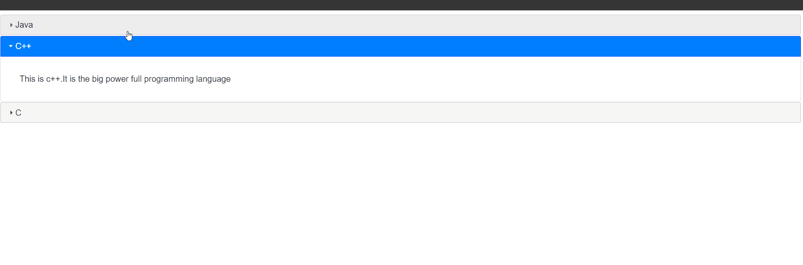

### Example 2

#### HTML

```HTML
<!DOCTYPE html>

<html>

	<head>

		<title>This is the title</title>

        <link  rel="stylesheet" href="jquery-ui.min.css" type="text/css" />

        <link href="style.css" rel="stylesheet" type="text/css" />

	</head>

<body>

    <div id="accordion">

      <h1>Java</h1>

        <div id="ac1">

            <p>Java is a best programming language that you can use language for ever</p>
        </div>

        <h1>C++</h1>

        <div id="ac2">

            <p>This is c++.It is the big power full programming language</p>
        </div>
        <h1>C</h1>

        <div id="ac2">

            <p>This is c.It is the big power full programming language</p>
        </div>

    </div>

    <script src="jquery-3.2.1.min.js" type="text/javascript"></script>
    <script src="jquery-ui.min.js" type="text/javascript"></script>

    <script src="js.js" type="text/javascript"></script>

</body>

</html>
```

#### JavaScript

```JavaScript
$(function () {//This is the shotcut for document load.

    $("#accordion").accordion({

        active: 1,//The active method specify the opened pane. 1 is the second pane. 0 is the first pane.
        animate:false//Disabled animation.

    });

});

//the accordion takes the first html element as heading then the secound element will be the contant box.
```

### Output

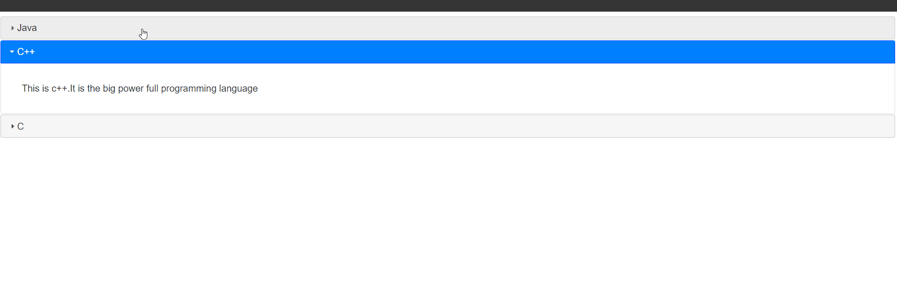

### Example 3

#### HTML

```HTML
<!DOCTYPE html>

<html>

	<head>

		<title>This is the title</title>

        <link  rel="stylesheet" href="jquery-ui.min.css" type="text/css" />

        <link href="style.css" rel="stylesheet" type="text/css" />

	</head>

<body>

    <div id="accordion">

      <h1>Java</h1>

        <div id="ac1">

            <p>Java is a best programming language that you can use language for ever</p>
        </div>

        <h1>C++</h1>

        <div id="ac2">

            <p>This is c++.It is the big power full programming language</p>
        </div>
        <h1>C</h1>

        <div id="ac2">

            <p>This is c.It is the big power full programming language</p>
        </div>

    </div>

    <script src="jquery-3.2.1.min.js" type="text/javascript"></script>
    <script src="jquery-ui.min.js" type="text/javascript"></script>

    <script src="js.js" type="text/javascript"></script>

</body>

</html>
```

#### JavaScript

```JavaScript
$(function () {//This is the shotcut for document load.

    $("#accordion").accordion({

        active: 1,//The active method specify the opened pane. 1 is the second pane. 0 is the first pane.
        animate:250//duration

    });

});

//the accordion takes the first html element as heading then the secound element will be the contant box.
```

### Output

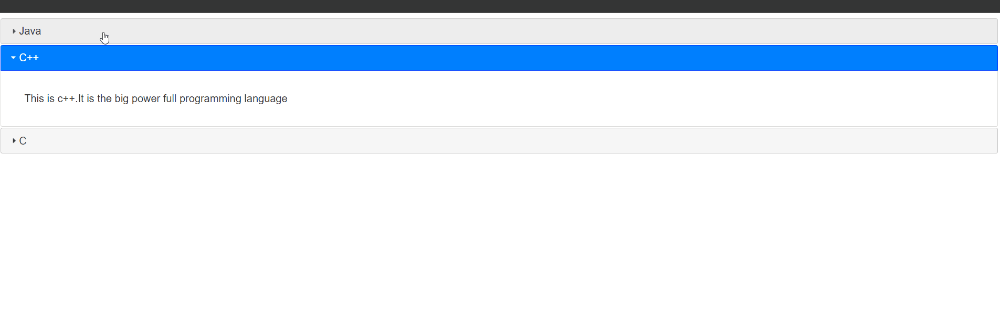

### Example 4

#### HTML

```HTML
<!DOCTYPE html>

<html>

	<head>

		<title>This is the title</title>

        <link  rel="stylesheet" href="jquery-ui.min.css" type="text/css" />

        <link href="style.css" rel="stylesheet" type="text/css" />

	</head>

<body>

    <div id="accordion">

      <h1>Java</h1>

        <div id="ac1">

            <p>Java is a best programming language that you can use language for ever</p>
        </div>

        <h1>C++</h1>

        <div id="ac2">

          <p>This is c++.It is the big power full programming language</p>
        </div>
        <h1>C</h1>

        <div id="ac2">

            <p>This is c.It is the big power full programming language</p>
        </div>

    </div>

    <script src="jquery-3.2.1.min.js" type="text/javascript"></script>
    <script src="jquery-ui.min.js" type="text/javascript"></script>

    <script src="js.js" type="text/javascript"></script>

</body>

</html>
```

#### JavaScript

```JavaScript
$(function () {//This is the shotcut for document load.

    $("#accordion").accordion({

        active: 1,//The active method specify the opened pane. 1 is the second pane. 0 is the first pane.
        animate: {//This is the animate full object.

            easing: "linear",//easing methoed.
            duration: 250,//duration
            down: {//This occurs when the pane is downing.

                easing: "easeOutBounce",//down easing method.
                duration:600//duration for downing.
            }

        }

    });

});

//the accordion takes the first html element as heading then the secound element will be the contant box.
```

### Output

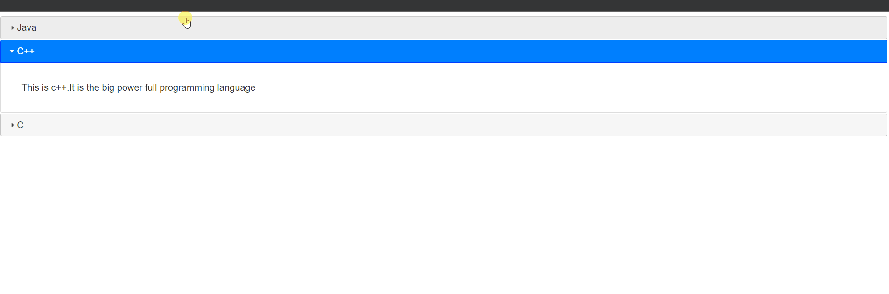

### Example 5

#### HTML

```HTML
<!DOCTYPE html>

<html>

	<head>

		<title>This is the title</title>

        <link  rel="stylesheet" href="jquery-ui.min.css" type="text/css" />

        <link href="style.css" rel="stylesheet" type="text/css" />

	</head>

<body>

    <div id="accordion">

      <h1>Java</h1>

        <div id="ac1">

            <p>Java is a best programming language that you can use language for ever</p>
        </div>

        <h1>C++</h1>

        <div id="ac2">

            <p>This is c++.It is the big power full programming language</p>
        </div>
        <h1>C</h1>

        <div id="ac2">

            <p>This is c.It is the big power full programming language</p>
        </div>

    </div>

    <script src="jquery-3.2.1.min.js" type="text/javascript"></script>
    <script src="jquery-ui.min.js" type="text/javascript"></script>

    <script src="js.js" type="text/javascript"></script>

</body>

</html>
```

#### JavaScript

```JavaScript
$(function () {//This is the shotcut for document load.

    $("#accordion").accordion({

        active: 1,//The active method specify the opened pane. 1 is the second pane. 0 is the first pane.
        animate: {//This is the animate full object.

            easing: "linear",//easing methoed.
            duration: 250,//duration
            down: {//This occurs when the pane is downing.

                easing: "easeOutBounce",//down easing method.
                duration:600//duration for downing.
            }

        },

        collapsible:true,//We can close all of the pane but by default we can't.

    });

});

//the accordion takes the first html element as heading then the secound element will be the contant box.
```

### Output


### Example 6

#### HTML

```HTML
<!DOCTYPE html>

<html>

	<head>

		<title>This is the title</title>

        <link  rel="stylesheet" href="jquery-ui.min.css" type="text/css" />

        <link href="style.css" rel="stylesheet" type="text/css" />

	</head>

<body>

    <div id="accordion">

      <h1>Java</h1>

        <div id="ac1">

            <p>Java is a best programming language that you can use language for ever</p>
        </div>

        <h1>C++</h1>

        <div id="ac2">

            <p>This is c++.It is the big power full programming language</p>
        </div>
        <h1>C</h1>

        <div id="ac2">

            <p>This is c.It is the big power full programming language</p>
        </div>

    </div><br />

    <input type="button" id="control" value="Disable" />

    <script src="jquery-3.2.1.min.js" type="text/javascript"></script>
    <script src="jquery-ui.min.js" type="text/javascript"></script>

    <script src="js.js" type="text/javascript"></script>

</body>

</html>
```

#### JavaScript

```JavaScript
$(function () {//This is the shotcut for document load.

    $("#accordion").accordion({

        active: 1,//The active method specify the opened pane. 1 is the second pane. 0 is the first pane.
        animate: {//This is the animate full object.

            easing: "linear",//easing methoed.
            duration: 250,//duration
            down: {//This occurs when the pane is downing.

                easing: "easeOutBounce",//down easing method.
                duration:600//duration for downing.
            }

        },

        collapsible:true,//We can close all of the pane but by default we can't.

    });

    $("#control").click(function () {

        if ($("#control").attr("value") == "Disable") {

            $("#accordion").accordion("disable");//Dissable the accordion.
            $("#control").attr("value", "Enable");//Change the btn values to "Enable".

        } else {//Otherwise.

            $("#accordion").accordion("enable");//enable the accordion.
            $("#control").attr("value", "Disable");//Change the btn values to "Disable".
        }

    });//This is application is like on and off Switch.

});

//the accordion takes the first html element as heading then the secound element will be the contant box.
```

### Output

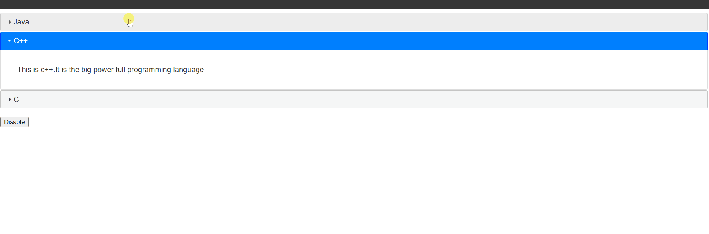

### Example 7

#### HTML

```HTML
<!DOCTYPE html>

<html>

	<head>

		<title>This is the title</title>

        <link  rel="stylesheet" href="jquery-ui.min.css" type="text/css" />

        <link href="style.css" rel="stylesheet" type="text/css" />

	</head>

<body>

    <div id="programming">

        <h1>Java</h1>

        <div>

            <h4>Java Progamming</h4>

            <p>Java programming is the programming language that we can use to program our computer</p>

        </div>

        <h1>C++</h1>

        <div>

            <h4>C++</h4>

            <p>This paragraph defines many tings that we can use to store data to the screen that is most imortant</p>

        </div>

        <h1>C</h1>

        <div>

            <h4>This javascript language is mainly used to create php scripting.this langugae is capable for everything that we can use to destory elemets</h4>

        </div>

    </div>

    <script src="jquery-3.2.1.min.js" type="text/javascript"></script>
    <script src="jquery-ui.min.js" type="text/javascript"></script>

    <script src="js.js" type="text/javascript"></script>

</body>

</html>
```

```html
<!DOCTYPE html>
<html>
<head>
    <title>Remote Tab</title>
	<meta charset="utf-8" />
</head>
<body>


    <p>This is the website that we can use to develop websites and download videos and develop many application by using more programming languages.</p>
    <h1>Hello</h1>
</body>
</html>
```

#### JavaScript

```JavaScript
$(document).ready(function () {

    $("#programming").accordion();

});

//accordion() makes an accordion panes.
```

### Output

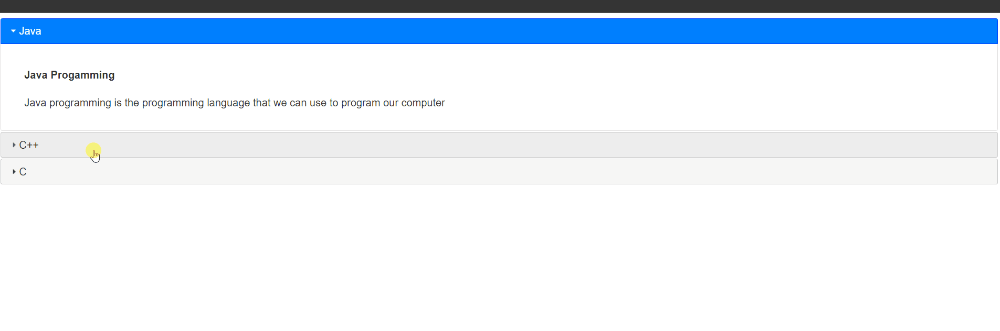

### Example 8

#### HTML

```HTML
<!DOCTYPE html>

<html>

	<head>

		<title>This is the title</title>

        <link  rel="stylesheet" href="jquery-ui.min.css" type="text/css" />

        <link href="style.css" rel="stylesheet" type="text/css" />

	</head>

<body>

    <div id="programming">

        <h1>Java</h1>

        <div>

            <h4>Java Progamming</h4>

            <p>Java programming is the programming language that we can use to program our computer</p>

        </div>

        <h1>C++</h1>

        <div>

            <h4>C++</h4>

            <p>This paragraph defines many tings that we can use to store data to the screen that is most imortant</p>

        </div>

        <h1>C</h1>

        <div>

            <h4>This javascript language is mainly used to create php scripting.this langugae is capable for everything that we can use to destory elemets</h4>

        </div>

    </div>

    <script src="jquery-3.2.1.min.js" type="text/javascript"></script>
    <script src="jquery-ui.min.js" type="text/javascript"></script>

    <script src="js.js" type="text/javascript"></script>

</body>

</html>
```

```HTML
<!DOCTYPE html>
<html>
<head>
    <title>Remote Tab</title>
	<meta charset="utf-8" />
</head>
<body>

    <p>This is the website that we can use to develop websites and download videos and develop many application by using more programming languages.</p>
    <h1>Hello</h1>
</body>
</html>
```

#### JavaScript

```JavaScript
$(document).ready(function () {

    $("#programming").accordion({

        collapsible:true//We can close pane by applying this keyword.
    });

});
```

### Output

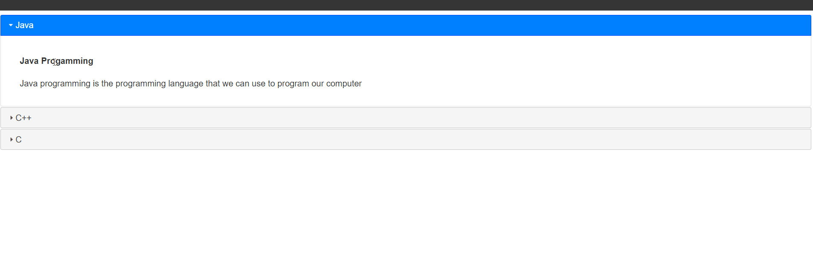

### Example 9

#### HTML

```HTML
<!DOCTYPE html>

<html>

	<head>

		<title>This is the title</title>

        <link  rel="stylesheet" href="jquery-ui.min.css" type="text/css" />

        <link href="style.css" rel="stylesheet" type="text/css" />

	</head>

<body>

    <div id="programming">

        <h1>Java</h1>

        <div>

            <h4>Java Progamming</h4>

            <p>Java programming is the programming language that we can use to program our computer</p>

        </div>

        <h1>C++</h1>

        <div>

            <h4>C++</h4>

            <p>This paragraph defines many tings that we can use to store data to the screen that is most imortant</p>

        </div>

        <h1>C</h1>

        <div>

            <h4>This javascript language is mainly used to create php scripting.this langugae is capable for everything that we can use to destory elemets</h4>

        </div>

    </div>

    <script src="jquery-3.2.1.min.js" type="text/javascript"></script>
    <script src="jquery-ui.min.js" type="text/javascript"></script>

    <script src="js.js" type="text/javascript"></script>

</body>

</html>
```

```HTML
<!DOCTYPE html>
<html>
<head>
    <title>Remote Tab</title>
	<meta charset="utf-8" />
</head>
<body>

    <p>This is the website that we can use to develop websites and download videos and develop many application by using more programming languages.</p>
    <h1>Hello</h1>
</body>
</html>
```

#### JavaScript

```JavaScript
$(document).ready(function () {

    $("#programming").accordion({

        active: 1//active defines the default opened pane. 1 is second 2 is first.

    });

});
```

### Output

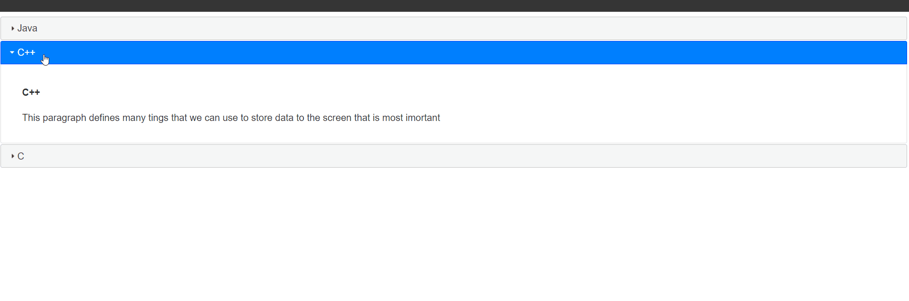

### Example 10

#### HTML

```HTML
<!DOCTYPE html>

<html>

	<head>

		<title>This is the title</title>

        <link  rel="stylesheet" href="jquery-ui.min.css" type="text/css" />

        <link href="style.css" rel="stylesheet" type="text/css" />

	</head>

<body>

    <div id="programming">

        <h1>Java</h1>

        <div>

            <h4>Java Progamming</h4>

            <p>Java programming is the programming language that we can use to program our computer</p>

        </div>

        <h1>C++</h1>

        <div>

            <h4>C++</h4>

            <p>This paragraph defines many tings that we can use to store data to the screen that is most imortant</p>

        </div>

        <h1>C</h1>

        <div>

            <h4>This javascript language is mainly used to create php scripting.this langugae is capable for everything that we can use to destory elemets</h4>

        </div>

    </div>    

    <script src="jquery-3.2.1.min.js" type="text/javascript"></script>
    <script src="jquery-ui.min.js" type="text/javascript"></script>

    <script src="js.js" type="text/javascript"></script>

</body>

</html>
```

```HTML
<!DOCTYPE html>
<html>
<head>
    <title>Remote Tab</title>
	<meta charset="utf-8" />
</head>
<body>

    <p>This is the website that we can use to develop websites and download videos and develop many application by using more programming languages.</p>
    <h1>Hello</h1>
</body>
</html>
```

#### JavaScript

```JavaScript
$(document).ready(function () {

    $("#programming").accordion({

        active: true//This will close all panes.

    });

});
```

### Output

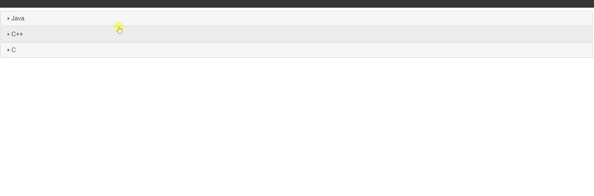

## 3. Dialog () Snippets

### Example 0

#### HTML

```HTML
<!DOCTYPE html>

<html>

	<head>

		<title>This is the title</title>

        <link  rel="stylesheet" href="jquery-ui.min.css" type="text/css" />

        <link href="style.css" rel="stylesheet" type="text/css" />

	</head>

<body>

    <div id="dialogBox">

        <h4>Java Progamming</h4>

        <p>You can learn java in many ways</p>

    </div>

    <script src="jquery-3.2.1.min.js" type="text/javascript"></script>
    <script src="jquery-ui.min.js" type="text/javascript"></script>

    <script src="js.js" type="text/javascript"></script>

</body>

</html>
```

```HTML
<!DOCTYPE html>
<html>
<head>
    <title>Remote Tab</title>
	<meta charset="utf-8" />
</head>
<body>

    <p>This is the website that we can use to develop websites and download videos and develop many application by using more programming languages.</p>
    <h1>Hello</h1>
</body>
</html>
```

#### JavaScript

```JavaScript
$(function () {//shortcut for ready Function.

    $("#dialogBox").dialog();

});

//This dialog() method will change the div as dialog box.
```

### Output

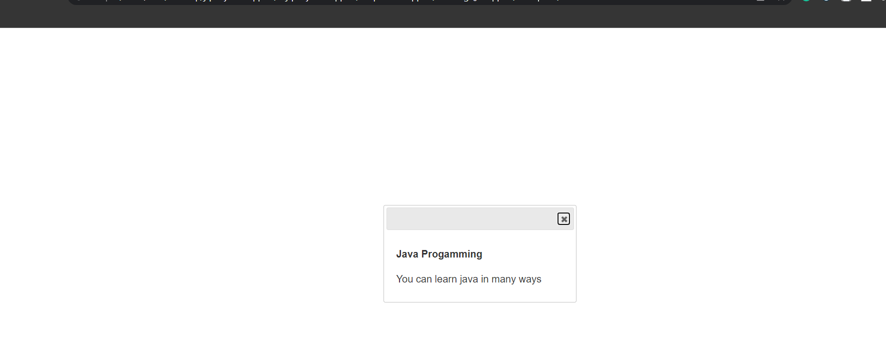

### Example 1

#### HTML

```HTML
<!DOCTYPE html>

<html>

	<head>

		<title>This is the title</title>

        <link  rel="stylesheet" href="jquery-ui.min.css" type="text/css" />

        <link href="style.css" rel="stylesheet" type="text/css" />

	</head>

<body>

    <div id="dialogBox">

        <h4>Java Progamming</h4>

        <p>You can learn java in many ways</p>

    </div>

    <input type="button" id="opener" value="Open the window" />

    <script src="jquery-3.2.1.min.js" type="text/javascript"></script>
    <script src="jquery-ui.min.js" type="text/javascript"></script>

    <script src="js.js" type="text/javascript"></script>

</body>

</html>
```

```HTML
<!DOCTYPE html>
<html>
<head>
    <title>Remote Tab</title>
	<meta charset="utf-8" />
</head>
<body>

    <p>This is the website that we can use to develop websites and download videos and develop many application by using more programming languages.</p>
    <h1>Hello</h1>
</body>
</html>
```

#### JavaScript

```JavaScript
$(function () {//shortcut for ready Function.

    $("#dialogBox").dialog({
        autoOpen:false//by default autoOpen is sat to true.
    });

    $("#opener").on("click", function () {//on() is same as bind() and addEventListener() in JS.

        $("#dialogBox").dialog("open");//This will let the user to open the window.

        });

});
```

### Output

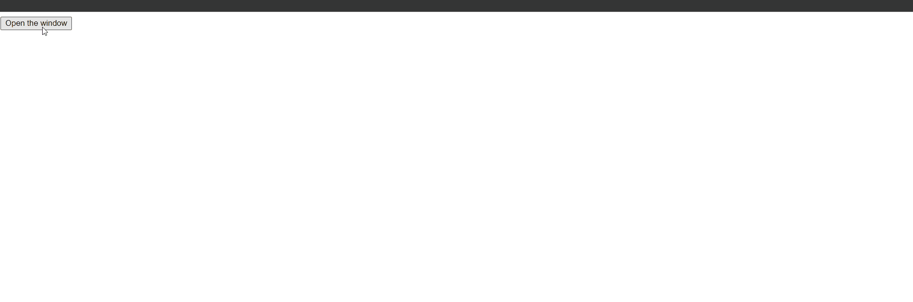

### Example 2

#### HTML

```HTML
<!DOCTYPE html>

<html>

	<head>

		<title>This is the title</title>

        <link  rel="stylesheet" href="jquery-ui.min.css" type="text/css" />

        <link href="style.css" rel="stylesheet" type="text/css" />

	</head>

<body>

    <div id="dialogBox">

        <h4>Java Progamming</h4>

        <p>You can learn java in many ways</p>

    </div>

    <script src="jquery-3.2.1.min.js" type="text/javascript"></script>
    <script src="jquery-ui.min.js" type="text/javascript"></script>

    <script src="js.js" type="text/javascript"></script>

</body>

</html>
```

```HTML
<!DOCTYPE html>
<html>
<head>
    <title>Remote Tab</title>
	<meta charset="utf-8" />
</head>
<body>

    <p>This is the website that we can use to develop websites and download videos and develop many application by using more programming languages.</p>
    <h1>Hello</h1>
</body>
</html>
```

#### JavaScript

```JavaScript
$(function () {//shortcut for ready Function.

    $("#dialogBox").dialog({

        show: {//This works when the dialog box is showen.

            effect: "fade",
            duration:1500
        },

        hide: {//This works when the dialog box is hidden.

            effect: "fade",
            duration:2000

        }

    });

});
```

### Output

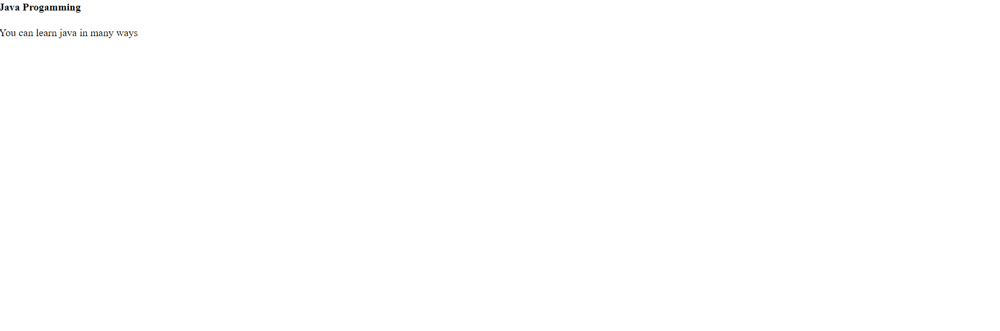
