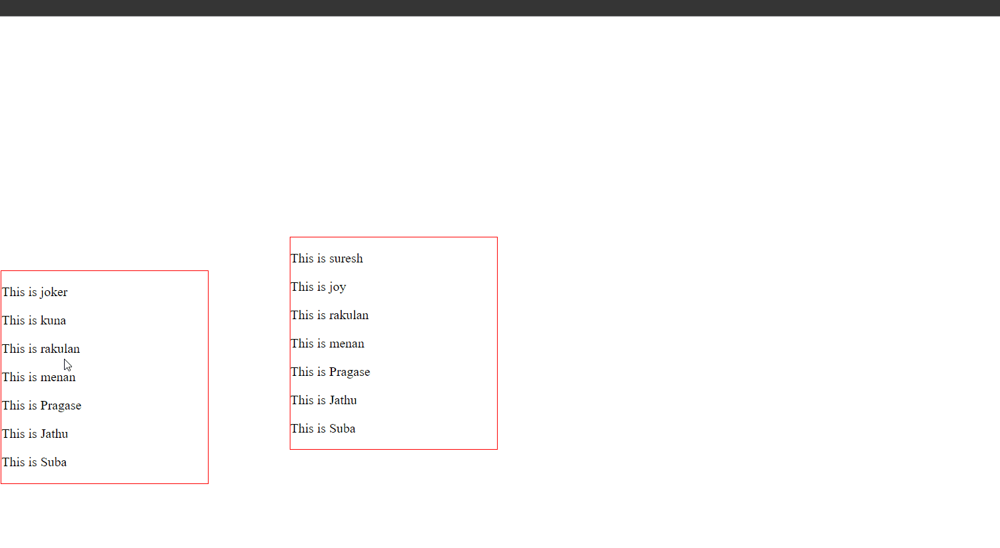
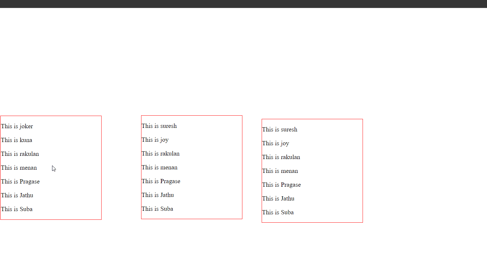
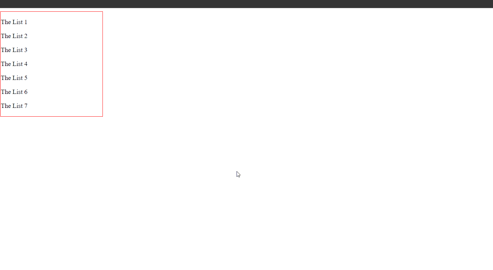
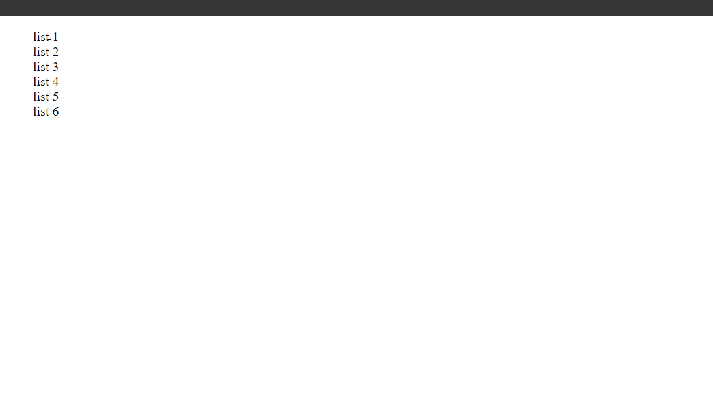

## 1. Sortable () Snippets

### Example 0

#### HTML

```HTML
<!DOCTYPE html>

<html>

	<head>

		<title>This is the title</title>

        <link  rel="stylesheet" href="jquery-ui.min.css" type="text/css" />

        <link href="style.css" rel="stylesheet" type="text/css" />

	</head>

<body>

    <div id="box1">

        <p class="item1">This is joker</p>
        <p class="item1">This is kuna</p>
        <p class="item1">This is rakulan</p>
        <p class="item1">This is menan</p>
        <p class="item1">This is Pragase</p>
        <p class="item1">This is Jathu</p>
        <p class="item1">This is Suba</p>

    </div>

    <div id="box2">
        <p class="item2">This is suresh</p>
        <p class="item2">This is joy</p>
        <p class="item2">This is rakulan</p>
        <p class="item2">This is menan</p>
        <p class="item2">This is Pragase</p>
        <p class="item2">This is Jathu</p>
        <p class="item2">This is Suba</p>

    </div>

    <script src="jquery-3.2.1.min.js" type="text/javascript"></script>
    <script src="jquery-ui.min.js" type="text/javascript"></script>

    <script src="js.js" type="text/javascript"></script>

</body>

</html>
```

#### CSS

```CSS
#box1{

    width:250px;
    height:auto;
    border:1px solid red;
    position:relative;
    top:300px;

}
#box2{

    width:250px;
    height:auto;
    border:1px solid red;
   position:relative;
   left:350px;

}
```

#### JavaScript

```JavaScript
$(document).ready(function () {

    $("#box1").sortable({

        connectWith:"#box2"

    });

    $("#box2").sortable({

        connectWith:"#box1"

    });

});

//The sortable() aollows to sort within boxes.
//connectWith is used to connects with others.
```

### Output



### Example 1

#### HTML

```HTML
<!DOCTYPE html>

<html>

	<head>

		<title>This is the title</title>

        <link  rel="stylesheet" href="jquery-ui.min.css" type="text/css" />

        <link href="style.css" rel="stylesheet" type="text/css" />

	</head>

<body>

    <div id="box1">

        <p class="item1">This is joker</p>
        <p class="item1">This is kuna</p>
        <p class="item1">This is rakulan</p>
        <p class="item1">This is menan</p>
        <p class="item1">This is Pragase</p>
        <p class="item1">This is Jathu</p>
        <p class="item1">This is Suba</p>

    </div>

    <div id="box2">
        <p class="item2">This is suresh</p>
        <p class="item2">This is joy</p>
        <p class="item2">This is rakulan</p>
        <p class="item2">This is menan</p>
        <p class="item2">This is Pragase</p>
        <p class="item2">This is Jathu</p>
        <p class="item2">This is Suba</p>

    </div>

    <div id="box3">
        <p class="item2">This is suresh</p>
        <p class="item2">This is joy</p>
        <p class="item2">This is rakulan</p>
        <p class="item2">This is menan</p>
        <p class="item2">This is Pragase</p>
        <p class="item2">This is Jathu</p>
        <p class="item2">This is Suba</p>

    </div>

    <script src="jquery-3.2.1.min.js" type="text/javascript"></script>
    <script src="jquery-ui.min.js" type="text/javascript"></script>

    <script src="js.js" type="text/javascript"></script>

</body>

</html>
```

#### CSS

```CSS
#box1{

    width:250px;
    height:auto;
    border:1px solid red;
    position:relative;
    top:260px;

}
#box2{

    width:250px;
    height:auto;
    border:1px solid red;
   position:relative;
   left:350px;

}

#box3{

    width:250px;
    height:auto;
    border:1px solid red;
   position:relative;
   left:650px;
   top:-250px;

}
```

#### JavaScript

```JavaScript
$(document).ready(function () {

    $("#box1").sortable({

        connectWith:"#box2,#box3"

    });

    $("#box2").sortable({

        connectWith:"#box1,#box3"

    });

    $("#box3").sortable({

        connectWith:"#box1,#box2"
    });
});

//The sortable() aollows to sort within boxes.
//connectWith is used to connects with others.
//we can connect more at one time by using a comma.
```

### Output



### Example 2

#### HTML

```HTML
<!DOCTYPE html>

<html>

	<head>

		<title>This is the title</title>

        <link  rel="stylesheet" href="jquery-ui.min.css" type="text/css" />

        <link href="style.css" rel="stylesheet" type="text/css" />

	</head>

<body>

    <div id="box1">

        <p class="item1">The List 1</p>
        <p class="item1">The List 2</p>
        <p class="item1">The List 3</p>
        <p class="item1">The List 4</p>
        <p class="item1">The List 5</p>
        <p class="item1">The List 6</p>
        <p class="item1">The List 7</p>

    </div>

    <script src="jquery-3.2.1.min.js" type="text/javascript"></script>
    <script src="jquery-ui.min.js" type="text/javascript"></script>

    <script src="js.js" type="text/javascript"></script>

</body>

</html>
```

#### CSS

```CSS
#box1{

    width:250px;
    height:auto;
    border:1px solid red;

}
```

#### JavaScript

```JavaScript
$(document).ready(function () {

    $("#box1").sortable({

        containment: "#box1"//document parent #box

    });

});

//The containment is the place that the list items can be sort or drag.
```

### Output



### Example 3

#### HTML

```HTML
<!DOCTYPE html>

<html>

	<head>

		<title>This is the title</title>

        <link  rel="stylesheet" href="jquery-ui.min.css" type="text/css" />

        <link href="style.css" rel="stylesheet" type="text/css" />

	</head>

<body>

    <ul id="lists">

        <li>list 1</li>
        <li>list 2</li>
        <li>list 3</li>
        <li>list 4</li>
        <li>list 5</li>
        <li>list 6</li>

    </ul>

    <script src="jquery-3.2.1.min.js" type="text/javascript"></script>
    <script src="jquery-ui.min.js" type="text/javascript"></script>

    <script src="js.js" type="text/javascript"></script>

</body>

</html>
```

#### CSS

```CSS
ul li {
    list-style-type:none;
}
```

#### JavaScript

```JavaScript
$(document).ready(function () {

    $("#lists").sortable({

    });

});
```

### Output


### Example 4

#### HTML

```HTML
<!DOCTYPE html>

<html>

	<head>

		<title>This is the title</title>

        <link  rel="stylesheet" href="jquery-ui.min.css" type="text/css" />

        <link href="style.css" rel="stylesheet" type="text/css" />

	</head>

<body>

    <ul id="lists">

        <li>list 1</li>
        <li>list 2</li>
        <li>list 3</li>
        <li>list 4</li>
        <li>list 5</li>
        <li>list 6</li>

    </ul>

    <script src="jquery-3.2.1.min.js" type="text/javascript"></script>
    <script src="jquery-ui.min.js" type="text/javascript"></script>

    <script src="js.js" type="text/javascript"></script>

</body>

</html>
```

#### CSS

```CSS
ul li {
    list-style-type:none;
}
```

#### JavaScript

```JavaScript
$(document).ready(function () {

    $("#lists").sortable({

       axis:"y"//This only allows to sort vertically.
    });

});
```

### Output


