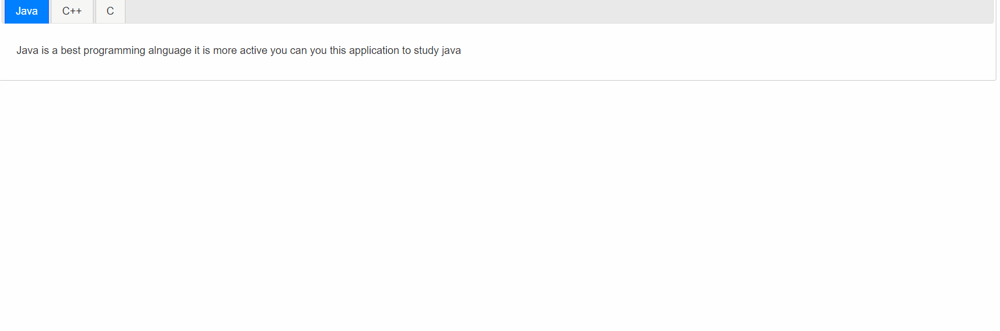
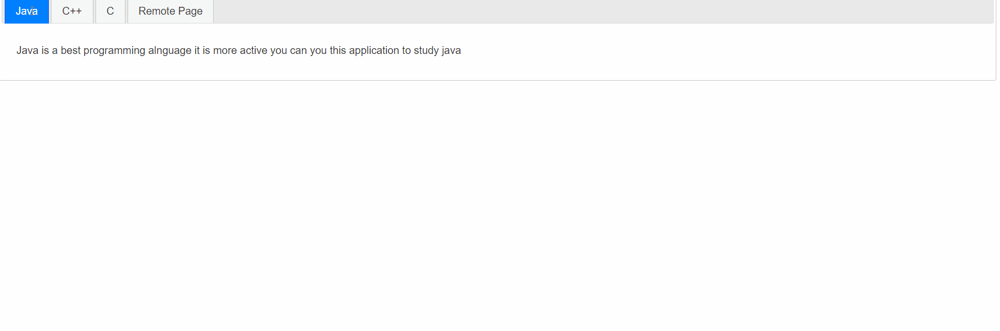
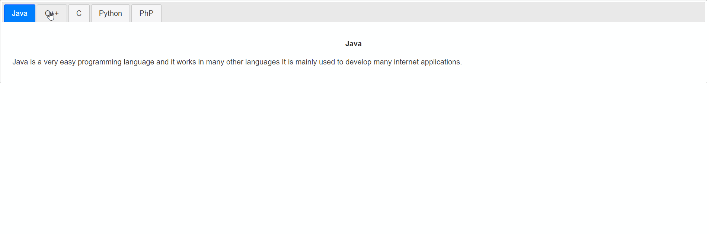
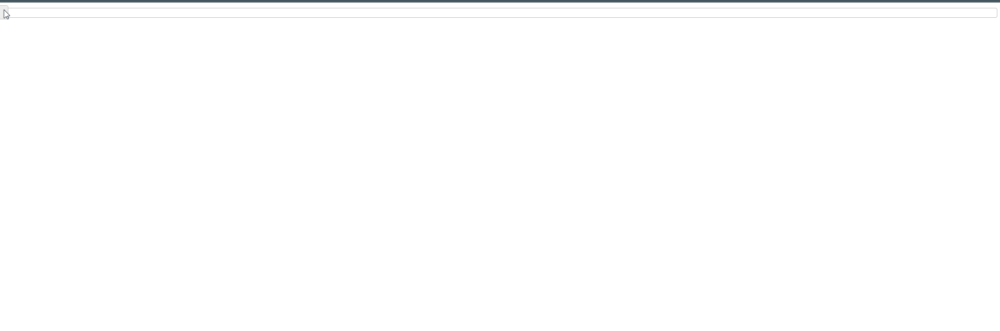
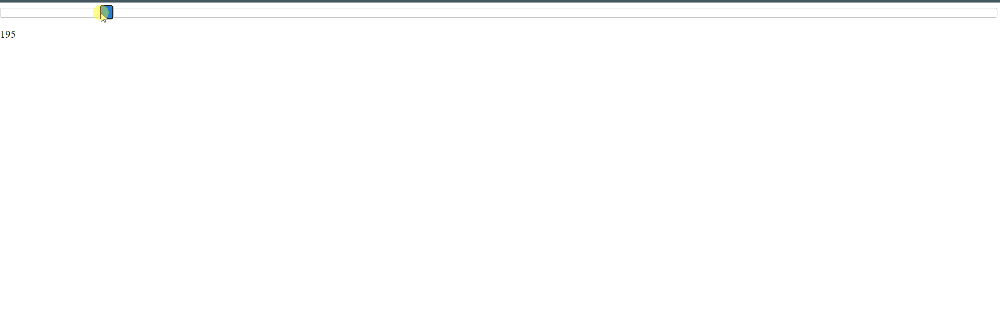
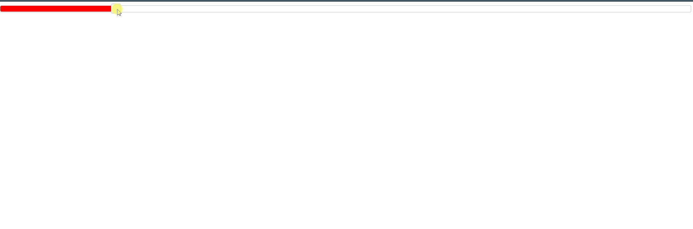
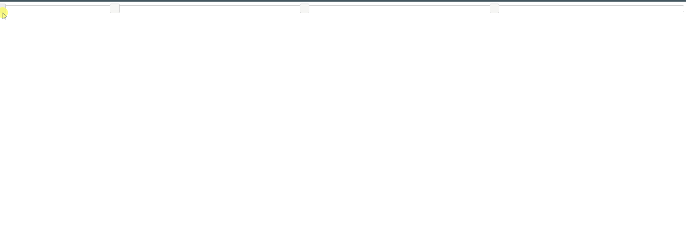
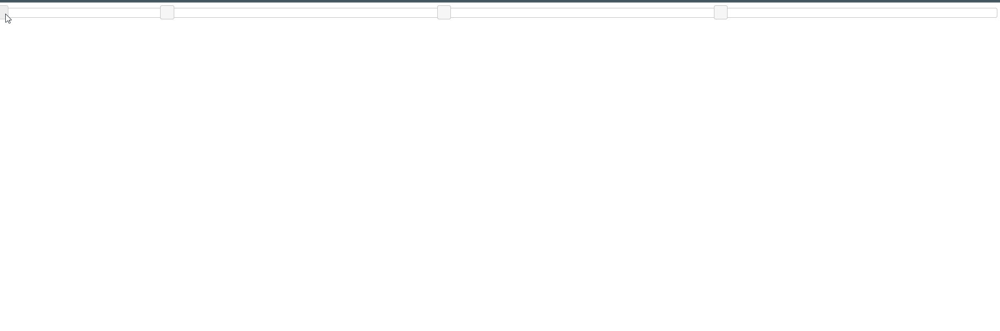
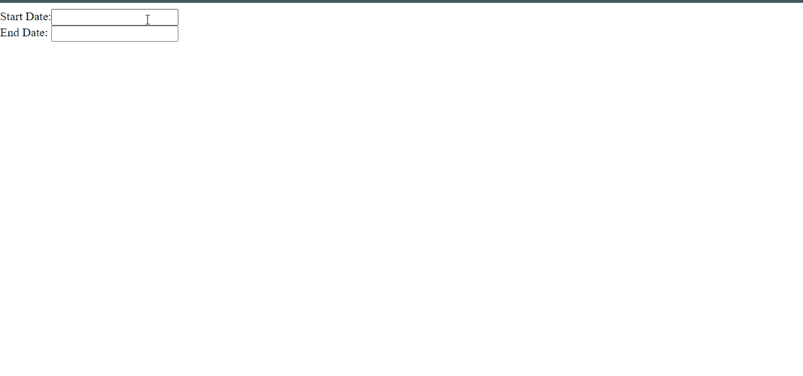

## 4. Tabs () Snippets

### Example 0

#### HTML

```HTML
<!DOCTYPE html>

<html>

	<head>

		<title>This is the title</title>

        <link  rel="stylesheet" href="jquery-ui.min.css" type="text/css" />

        <link href="style.css" rel="stylesheet" type="text/css" />

	</head>

<body>

    <div id="tab">

        <ul>

            <li><a href="#java">Java</a></li>
            <li><a href="#c++">C++</a></li>
            <li><a href="#c">C</a></li>

        </ul>

        <div id="java">

            <p>Java is a best programming alnguage it is more active you can you this application to study  java</p>

        </div>

        <div id="c++">

            <p>C++ is the best  pogamming langugae you learn this language in many ways</p>

        </div>

        <div id="c">
            <p>This is c programming language it is mainly used for interacite developments</p>

        </div>

    </div>

    <script src="jquery-3.2.1.min.js" type="text/javascript"></script>
    <script src="jquery-ui.min.js" type="text/javascript"></script>

    <script src="js.js" type="text/javascript"></script>

</body>

</html>
```

```HTML
<!DOCTYPE html>
<html>
<head>
    <title>Remote Tab</title>
	<meta charset="utf-8" />
</head>
<body>

    <p>This is the website that we can use to develop websites and download videos and develop many application by using more programming languages.</p>
    <h1>Hello</h1>
</body>
</html>
```

#### JavaScript

```JavaScript
$(document).ready(function () {

    $("#tab").tabs();

});
```

### Output



### Example 1

#### HTML

```HTML
<!DOCTYPE html>

<html>

	<head>

		<title>This is the title</title>

        <link  rel="stylesheet" href="jquery-ui.min.css" type="text/css" />

        <link href="style.css" rel="stylesheet" type="text/css" />

	</head>

<body>

    <div id="tab">

        <ul>

            <li><a href="#java">Java</a></li>
            <li><a href="#c++">C++</a></li>
            <li><a href="#c">C</a></li>
            <li><a href="remote.html">Remote Page</a></li>

        </ul>

        <div id="java">

            <p>Java is a best programming alnguage it is more active you can you this application to study  java</p>

        </div>

        <div id="c++">

            <p>C++ is the best  pogamming langugae you learn this language in many ways</p>

        </div>

        <div id="c">
            <p>This is c programming language it is mainly used for interacite developments</p>

        </div>

    </div>

    <script src="jquery-3.2.1.min.js" type="text/javascript"></script>
    <script src="jquery-ui.min.js" type="text/javascript"></script>

    <script src="js.js" type="text/javascript"></script>

</body>

</html>
```

#### JavaScript

```JavaScript
$(document).ready(function () {

    $("#tab").tabs();

});

//Xaamp is requried
```

### Output



### Example 2

#### HTML

```HTML
<!DOCTYPE html>

<html>

	<head>

		<title>This is the title</title>

        <link  rel="stylesheet" href="jquery-ui.min.css" type="text/css" />

        <link href="style.css" rel="stylesheet" type="text/css" />

	</head>

<body>

    <div id="programmings">

        <ul>

            <li><a href="#java">Java</a></li>
            <li><a href="#c++">C++</a></li>
            <li><a href="#c">C</a></li>
            <li><a href="#python">Python</a></li>
            <li><a href="php.html">PhP</a></li>
        </ul>

        <div id="java">

            <h4 style="text-align:center;">Java</h4>
            <p>Java is a very easy programming language and it works in many other languages It is mainly used to develop many internet applications.</p>
        </div>

        <div id="c++">

            <h4 style="text-align:center;">C++</h4>

            <p>C++ is the best programming language that you can use to develop many applications by  using this programming language you will get many application works,</p>
        </div>

        <div id="c">

            <h4 style="text-align:center;">C</h4>

            <p>C is the best programming language you can accomplich all  algorithem by using c programming langugae</p>
        </div>

        <div id="python">

            <h4 style="text-align:center;">Python</h4>

            <p>Python is a robotic programming language that can be used for all projects.</p>

        </div>

    </div>

    <script src="jquery-3.2.1.min.js" type="text/javascript"></script>
    <script src="jquery-ui.min.js" type="text/javascript"></script>

    <script src="js.js" type="text/javascript"></script>

</body>

</html>
```

#### JavaScript

```JavaScript
$(document).ready(function () {

    $("#programmings").tabs();

});
//tabs() makes an tabs pane.
//Xaamp is required.Because i have used extrernal html files.tabs uses AJAX to load external files.
```


#### PHP

```PHP
<!DOCTYPE html>
<html>
<head>
    <title></title>
	<meta charset="utf-8" />
</head>
<body>

    <h1 style="text-align:center">PHP programming language</h1>

    <p>PhP programming is mainly for server programming.It not an object oriened programming language</p>

</body>
</html>
```

### Output



## 5. Slider () Snippets

### Example 0

#### HTML

```HTML
<!DOCTYPE html>

<html>

	<head>

		<title>This is the title</title>

        <link  rel="stylesheet" href="jquery-ui.min.css" type="text/css" />

        <link href="style.css" rel="stylesheet" type="text/css" />

	</head>

<body>

    <div id="slider"></div>
    <p id="slideText"></p>

    <script src="jquery-3.2.1.min.js" type="text/javascript"></script>
    <script src="jquery-ui.min.js" type="text/javascript"></script>

    <script src="js.js" type="text/javascript"></script>

</body>

</html>
```

#### JavaScript

```JavaScript
$(document).ready(function () {

    $("#slider").slider({

        slide: function (event, ui) {

            $("#slideText").text(ui.value);
        }
    });

});

//slider() makes an div as a slider.
//slide:function is output the values.Code is above.
```

#### PHP

```PHP
<!DOCTYPE html>
<html>
<head>
    <title></title>
	<meta charset="utf-8" />
</head>
<body>

    <h1 style="text-align:center">PHP programming language</h1>

    <p>PhP programming is mainly for server programming.It not an object oriened programming language</p>

</body>
</html>
```

### Output



### Example 1

#### HTML

```HTML
<!DOCTYPE html>

<html>

	<head>

		<title>This is the title</title>

        <link  rel="stylesheet" href="jquery-ui.min.css" type="text/css" />

        <link href="style.css" rel="stylesheet" type="text/css" />

	</head>

<body>

    <div id="slider"></div>
    <p id="slideText"></p>

    <script src="jquery-3.2.1.min.js" type="text/javascript"></script>
    <script src="jquery-ui.min.js" type="text/javascript"></script>

    <script src="js.js" type="text/javascript"></script>

</body>

</html>
```

#### JavaScript

```JavaScript
$(document).ready(function () {

    $("#slider").slider({

        slide: function (event, ui) {

            $("#slideText").text(ui.value);
        },

        min: 100,//minimum value the starting point.
        max: 1000,//maxinum value the ending point.
        value: 250,//This is the current value that slider button stick in.
        step:5//This is the step that can be moved.by default 1
    });

});

//slider() makes an div as a slider.
//slide:function is output the values.Code is above.
```

#### PHP

```PHP
<!DOCTYPE html>
<html>
<head>
    <title></title>
	<meta charset="utf-8" />
</head>
<body>

    <h1 style="text-align:center">PHP programming language</h1>

    <p>PhP programming is mainly for server programming.It not an object oriened programming language</p>

</body>
</html>
```

### Output



### Example 2

#### HTML

```HTML
<!DOCTYPE html>

<html>

	<head>

		<title>This is the title</title>

        <link  rel="stylesheet" href="jquery-ui.min.css" type="text/css" />

        <link href="style.css" rel="stylesheet" type="text/css" />

	</head>

<body>

    <div id="slider"></div>
    <p id="slideText"></p>

    <script src="jquery-3.2.1.min.js" type="text/javascript"></script>
    <script src="jquery-ui.min.js" type="text/javascript"></script>

    <script src="js.js" type="text/javascript"></script>

</body>

</html>
```

#### CSS

```CSS
#slider .ui-slider-range {

    background:red;
}
```

#### JavaScript

```JavaScript
$(document).ready(function () {

    $("#slider").slider({

        slide: function (event, ui) {

            $("#slideText").text(ui.value);
        },

        min: 100,//minimum value the starting point.
        max: 1000,//maxinum value the ending point.
        value: 250,//This is the current value that slider button stick in.
        step: 5,//This is the step that can be moved.by default 1
        range:"min"//This wil highlighted selected value. form starting to current.
    });

});

//slider() makes an div as a slider.
//slide:function is output the values.Code is above.

/*
#slider .ui-slider-range {

    background:red;
}

This is code to change the background-color of the highlighted value. use background don't use background-color.

 */
```

#### PHP

```PHP
<!DOCTYPE html>
<html>
<head>
    <title></title>
	<meta charset="utf-8" />
</head>
<body>

    <h1 style="text-align:center">PHP programming language</h1>

    <p>PhP programming is mainly for server programming.It not an object oriened programming language</p>

</body>
</html>
```

### Output



### Example 3

#### HTML

```HTML
<!DOCTYPE html>

<html>

	<head>

		<title>This is the title</title>

        <link  rel="stylesheet" href="jquery-ui.min.css" type="text/css" />

        <link href="style.css" rel="stylesheet" type="text/css" />

	</head>

<body>

    <div id="slider"></div>
    <p id="slideText"></p>

    <script src="jquery-3.2.1.min.js" type="text/javascript"></script>
    <script src="jquery-ui.min.js" type="text/javascript"></script>

    <script src="js.js" type="text/javascript"></script>

</body>

</html>
```

#### CSS

```CSS
#slider .ui-slider-range {

    background:red;
```

#### JavaScript

```JavaScript
$(document).ready(function () {

    $("#slider").slider({
        min: 100,
        max:1000,
        values:[250,500,63,750],//values allows mutiple slider pins.

    });

});
```

#### PHP

```PHP
<!DOCTYPE html>
<html>
<head>
    <title></title>
	<meta charset="utf-8" />
</head>
<body>

    <h1 style="text-align:center">PHP programming language</h1>

    <p>PhP programming is mainly for server programming.It not an object oriened programming language</p>

</body>
</html>
```

### Output



### Example 4

#### HTML

```HTML
<!DOCTYPE html>

<html>

	<head>

		<title>This is the title</title>

        <link  rel="stylesheet" href="jquery-ui.min.css" type="text/css" />

        <link href="style.css" rel="stylesheet" type="text/css" />

	</head>

<body>

    <div id="slider"></div>
    <p id="slideText"></p>

    <script src="jquery-3.2.1.min.js" type="text/javascript"></script>
    <script src="jquery-ui.min.js" type="text/javascript"></script>

    <script src="js.js" type="text/javascript"></script>

</body>

</html>
```

#### CSS

```CSS
#slider .ui-slider-range {

    background:red;
}
```

#### JavaScript

```JavaScript
$(document).ready(function () {

    $("#slider").slider({
        min: 100,
        max:1000,
        values: [250, 500, 63, 750],//values allows mutiple slider pins.
        slide: function (event, ui) {

            $("#slideText").text(ui.values[]);
        }

    });

});
```

#### PHP

```PHP
<!DOCTYPE html>
<html>
<head>
    <title></title>
	<meta charset="utf-8" />
</head>
<body>

    <h1 style="text-align:center">PHP programming language</h1>

    <p>PhP programming is mainly for server programming.It not an object oriened programming language</p>

</body>
</html>
```

### Output


### Example 5

#### HTML

```HTML
<!DOCTYPE html>

<html>

	<head>

		<title>This is the title</title>

        <link  rel="stylesheet" href="jquery-ui.min.css" type="text/css" />

        <link href="style.css" rel="stylesheet" type="text/css" />

	</head>

<body>

    <div id="slider"></div>
    <p id="slideText"></p>

    <script src="jquery-3.2.1.min.js" type="text/javascript"></script>
    <script src="jquery-ui.min.js" type="text/javascript"></script>

    <script src="js.js" type="text/javascript"></script>

</body>

</html>
```

#### CSS

```CSS
#slider .ui-slider-range {

    background:red;
}
```

#### JavaScript

```JavaScript
$(document).ready(function () {

    $("#slider").slider({
        min: 100,
        max:1000,
        values: [250, 500, 63, 750],//values allows mutiple slider pins.
        slide: function (event, ui) {

            $("#slideText").text(ui.values[0]+" to "+ui.values[1]+" to "+ui.values[2]+" to "+ui.values[3]);

        }

    });

});
```

#### PHP

```PHP
<!DOCTYPE html>
<html>
<head>
    <title></title>
	<meta charset="utf-8" />
</head>
<body>

    <h1 style="text-align:center">PHP programming language</h1>

    <p>PhP programming is mainly for server programming.It not an object oriened programming language</p>

</body>
</html>
```

### Output



## 6. Date Picker () Snippets

### Example 0

#### HTML

```HTML
<!DOCTYPE html>

<html>

	<head>

		<title>This is the title</title>

        <link  rel="stylesheet" href="jquery-ui.min.css" type="text/css" />

        <link href="style.css" rel="stylesheet" type="text/css" />

	</head>

<body>

    <label>Start Date:<input type="text" id="startd" /></label><br />
    <label>End Date: <input type="text" id="endd" /></label>

    <script src="jquery-3.2.1.min.js" type="text/javascript"></script>
    <script src="jquery-ui.min.js" type="text/javascript"></script>

    <script src="js.js" type="text/javascript"></script>

</body>

</html>
```

#### JavaScript

```JavaScript
$(document).ready(function () {

    $("#startd").datepicker({

        showAnim: "slideDown",//The animation effect.
        dateFormat:"yy-mm-dd"//This is the format of the date we can use any symbol instead of -.
    });

    $("#endd").datepicker({

        showAnim: "slideDown",
        dateFormat:"mm-yy-dd"

    });

});
```

### Output


### Example 1

#### HTML

```HTML
<!DOCTYPE html>

<html>

	<head>

		<title>This is the title</title>

        <link  rel="stylesheet" href="jquery-ui.min.css" type="text/css" />

        <link href="style.css" rel="stylesheet" type="text/css" />

	</head>

<body>

    <label>Start Date:<input type="text" id="startd" /></label><br />
    <label>End Date: <input type="text" id="endd" /></label>

    <script src="jquery-3.2.1.min.js" type="text/javascript"></script>
    <script src="jquery-ui.min.js" type="text/javascript"></script>

    <script src="js.js" type="text/javascript"></script>

</body>

</html>
```

#### JavaScript

```JavaScript
$(document).ready(function () {

    $("#startd").datepicker({

        showAnim: "slideDown",//The animation effect.
        dateFormat: "yy-mm-dd",//This is the format of the date we can use any symbol instead of -.
        numberOfMonths:3//This will show 3 months pane.
    });

    $("#endd").datepicker({

        showAnim: "slideDown",
        dateFormat: "mm-yy-dd",
        numberOfMonths:3

    });

});
```

### Output


