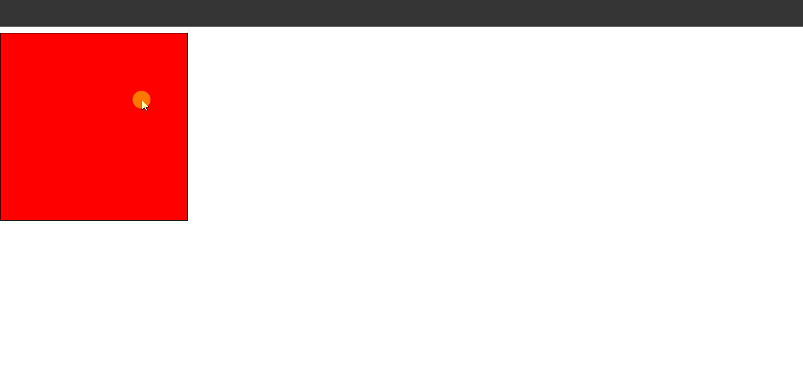
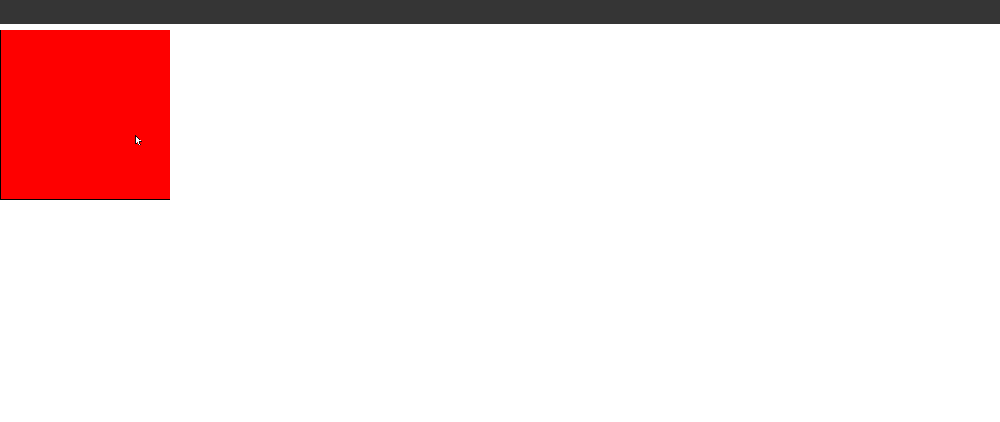
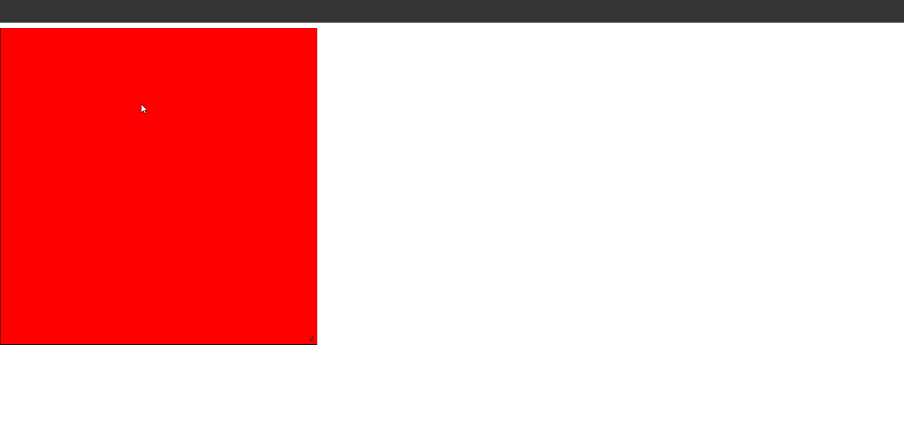

## 7. Icons Snippets

### Example 0

#### HTML

```HTML
<!DOCTYPE html>

<html>

	<head>

		<title>This is the title</title>

        <link  rel="stylesheet" href="jquery-ui.min.css" type="text/css" />

        <link href="style.css" rel="stylesheet" type="text/css" />

	</head>

<body>

  <button id="btn1">Hello</button>

    <script src="jquery-3.2.1.min.js" type="text/javascript"></script>
    <script src="jquery-ui.min.js" type="text/javascript"></script>

    <script src="js.js" type="text/javascript"></script>

</body>

</html>
```

#### JavaScript

```JavaScript
$(document).ready(function () {

    $("#btn1").button({

        icons: {
            primary:"ui-icon-info"
        },

    });

});

//serach online for icons names.
```

### Output


## 8. Button () Snippets

### Example 0

#### HTML

```HTML
<!DOCTYPE html>

<html>

	<head>

		<title>This is the title</title>

        <link  rel="stylesheet" href="jquery-ui.min.css" type="text/css" />

        <link href="style.css" rel="stylesheet" type="text/css" />

	</head>

<body>

    <p id="k">Java</p>

    <script src="jquery-3.2.1.min.js" type="text/javascript"></script>
    <script src="jquery-ui.min.js" type="text/javascript"></script>

    <script src="js.js" type="text/javascript"></script>

</body>

</html>
```

#### JavaScript

```JavaScript
$(function () {

    $("#k").button();

});
```

### Output


## 9. Draggable () Snippets

### Example 0

#### HTML

```HTML
<!DOCTYPE html>

<html>

	<head>

		<title>This is the title</title>

        <link  rel="stylesheet" href="jquery-ui.min.css" type="text/css" />

        <link href="style.css" rel="stylesheet" type="text/css" />

	</head>

<body>

    <div id="box"></div>

    <script src="jquery-3.2.1.min.js" type="text/javascript"></script>
    <script src="jquery-ui.min.js" type="text/javascript"></script>

    <script src="js.js" type="text/javascript"></script>

</body>

</html>
```

#### CSS

```CSS
#box {

    width:250px;
    height:250px;
    border:1px solid black;
    background-color:red;
}
```

#### JavaScript

```JavaScript
$(document).ready(function () {

    $("#box").draggable();

});
```

### Output



### Example 1

#### HTML

```HTML
<!DOCTYPE html>

<html>

	<head>

		<title>This is the title</title>

        <link  rel="stylesheet" href="jquery-ui.min.css" type="text/css" />

        <link href="style.css" rel="stylesheet" type="text/css" />

	</head>

<body>

    <div id="box"></div>

    <script src="jquery-3.2.1.min.js" type="text/javascript"></script>
    <script src="jquery-ui.min.js" type="text/javascript"></script>

    <script src="js.js" type="text/javascript"></script>

</body>

</html>
```

#### CSS

```CSS
#box {

    width:250px;
    height:250px;
    border:1px solid black;
    background-color:red;
}
```

#### JavaScript

```JavaScript
$(document).ready(function () {

    $("#box").draggable({

        grid: [50,50]//grid allows to drag depanding on the grid value.
    });

});
```

### Output


### Example 2

#### HTML

```HTML
<!DOCTYPE html>

<html>

	<head>

		<title>This is the title</title>

        <link  rel="stylesheet" href="jquery-ui.min.css" type="text/css" />

        <link href="style.css" rel="stylesheet" type="text/css" />

	</head>

<body>

    <div id="box"></div>

    <script src="jquery-3.2.1.min.js" type="text/javascript"></script>
    <script src="jquery-ui.min.js" type="text/javascript"></script>

    <script src="js.js" type="text/javascript"></script>

</body>

</html>
```

#### CSS

```CSS
#box {

    width:250px;
    height:250px;
    border:1px solid black;
    background-color:red;
}
```

#### JavaScript

```JavaScript
$(document).ready(function () {

    $("#box").draggable({

        axis:"x"//This will only allows to darg horzontally.
		//"y" allows vertically.
    });

});
```

### Output


### Example 3

#### HTML

```HTML
<!DOCTYPE html>

<html>

	<head>

		<title>This is the title</title>

        <link  rel="stylesheet" href="jquery-ui.min.css" type="text/css" />

        <link href="style.css" rel="stylesheet" type="text/css" />

	</head>

<body>

    <div id="box"></div>

    <script src="jquery-3.2.1.min.js" type="text/javascript"></script>
    <script src="jquery-ui.min.js" type="text/javascript"></script>

    <script src="js.js" type="text/javascript"></script>

</body>

</html>
```

#### CSS

```CSS
#box {

    width:250px;
    height:250px;
    border:1px solid black;
    background-color:red;
}
```

#### JavaScript

```JavaScript
$(document).ready(function () {

    $("#box").draggable({

        start: function () {//This will work when the dragging is stated.

            $(this).css("background-color", "green");

        },

        stop: function () {//This will work when the dragging is stoped.

            $(this).css("background-color", "red");

        }
    });

});
```

### Output



### Example 4

#### HTML

```HTML
<!DOCTYPE html>

<html>

	<head>

		<title>This is the title</title>

        <link  rel="stylesheet" href="jquery-ui.min.css" type="text/css" />

        <link href="style.css" rel="stylesheet" type="text/css" />

	</head>

<body>

    <input id="make" type="button" value="Make Ele" />

    <script src="jquery-3.2.1.min.js" type="text/javascript"></script>
    <script src="jquery-ui.min.js" type="text/javascript"></script>

    <script src="js.js" type="text/javascript"></script>

</body>

</html>
```

#### CSS

```CSS
ul li {
    list-style-type:none;
}
```

#### JavaScript

```JavaScript
$(document).ready(function () {

    $("#make").on("click", makePra)//on() is like bind() and addEventListener() in Javascript.

    function makePra() {

        var p = $("<p  contenteditable='true' class='k'>Joker Hacker </p>");//I make elements like this.
        $("body").append(p);//I append this to the body element.

        $(".k").draggable();//The text can be draggable.

    }

});
```

### Output


## 10. Resizable () Snippets

### Example 0

#### HTML

```HTML
<!DOCTYPE html>

<html>

	<head>

		<title>This is the title</title>

        <link  rel="stylesheet" href="jquery-ui.min.css" type="text/css" />

        <link href="style.css" rel="stylesheet" type="text/css" />

	</head>

<body>

    <div id="box"></div>

    <script src="jquery-3.2.1.min.js" type="text/javascript"></script>
    <script src="jquery-ui.min.js" type="text/javascript"></script>

    <script src="js.js" type="text/javascript"></script>

</body>

</html>
```

#### CSS

```CSS
#box {

    width:500px;
    height:500px;
    border:1px solid black;
    background-color:red;
}
```

#### JavaScript

```JavaScript
$(document).ready(function () {

    $("#box").resizable();

});

//resizable() allows to resize things like this.
```

### Output


### Example 1

#### HTML

```HTML
<!DOCTYPE html>

<html>

	<head>

		<title>This is the title</title>

        <link  rel="stylesheet" href="jquery-ui.min.css" type="text/css" />

        <link href="style.css" rel="stylesheet" type="text/css" />

	</head>

<body>

    <div id="box"></div>

    <script src="jquery-3.2.1.min.js" type="text/javascript"></script>
    <script src="jquery-ui.min.js" type="text/javascript"></script>

    <script src="js.js" type="text/javascript"></script>

</body>

</html>
```

#### CSS

```CSS
#box {

    width:500px;
    height:500px;
    border:1px solid black;
    background-color:red;
}
```

#### JavaScript

```JavaScript
$(document).ready(function () {

    $("#box").resizable({

        handles:"n,e,s,w,ne,se,sw,nw"//All sites
    }).draggable({//This allows to drag the div element.


        start: function () {//when dragging is started.

            $(this).css("background-color", "green");

        },

        stop: function () {//when dragging is stoped.

            $(this).css("background-color", 'red');
        }
    });

});

//resizable() allows to resize things like this.
```

### Output


