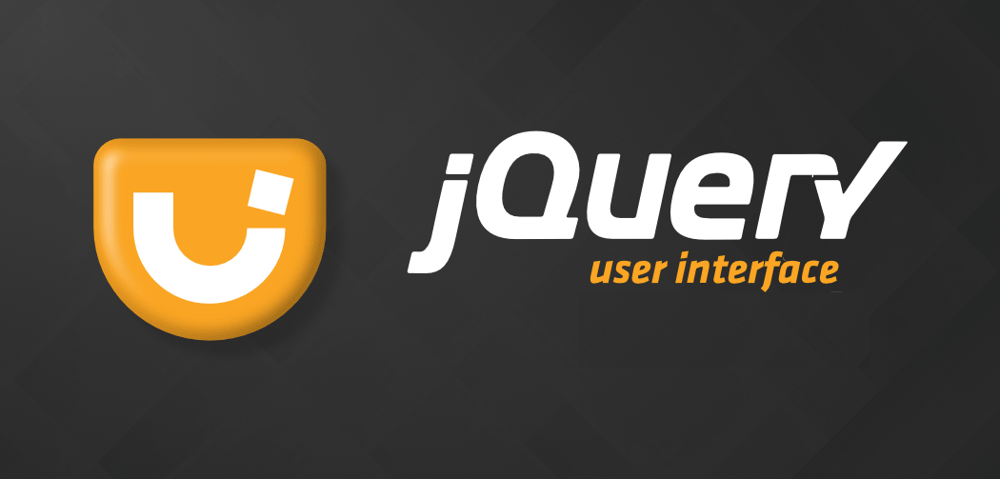

# jQuery UI Snippets

## Introduction

jQuery is a powerful Javascript library built on top of jQuery JavaScript library. UI stands for User interface, It is a set of plug-ins for jQuery that adds new functionalities to the jQuery core library.

jQuery UI is a collection of GUI widgets, animated visual effects, and themes implemented with jQuery, Cascading Style Sheets, and HTML. According to JavaScript analytics service, Libscore, jQuery UI was used on over 197,000 of the top one million websites, making it the second most popular JavaScript library.

The set of plug-ins in JqueryUI includes interface interactions, effects, animations, widgets, and themes built on top of jQuery JavaScript Library.

It was released in September 2007, announced in a blog post by John Resig on jquery.com. The latest release, 1.10.4, requires jQuery 1.6 or later version. jQuery UI is a free, open source software, licensed under the MIT License.

## Learning Resources

1. [The New Bonston Snippets](1-the-new-bonston-snippets/)
2. [jQuery UI Snippets](2-jquery-ui-snippets/)

## Social Links

* [Linkedin Profile](https://www.linkedin.com/in/gunarakulangunaretnam)
* [Facebook Profile](https://www.facebook.com/gunarakulangr.page)
* [Instagram Profile](https://www.instagram.com/gunarakulangunaretnam)
* [Twitter Profile ](https://twitter.com/gunarakulangr)
* [Kaggle Profile](https://www.kaggle.com/gunarakulangr)
* [TikTok Profile](https://www.tiktok.com/@gunarakulangunaretnam)
* [Youtube Profile](https://www.youtube.com/channel/UCMWkED5sabgVZSCKjZuRJXA)
